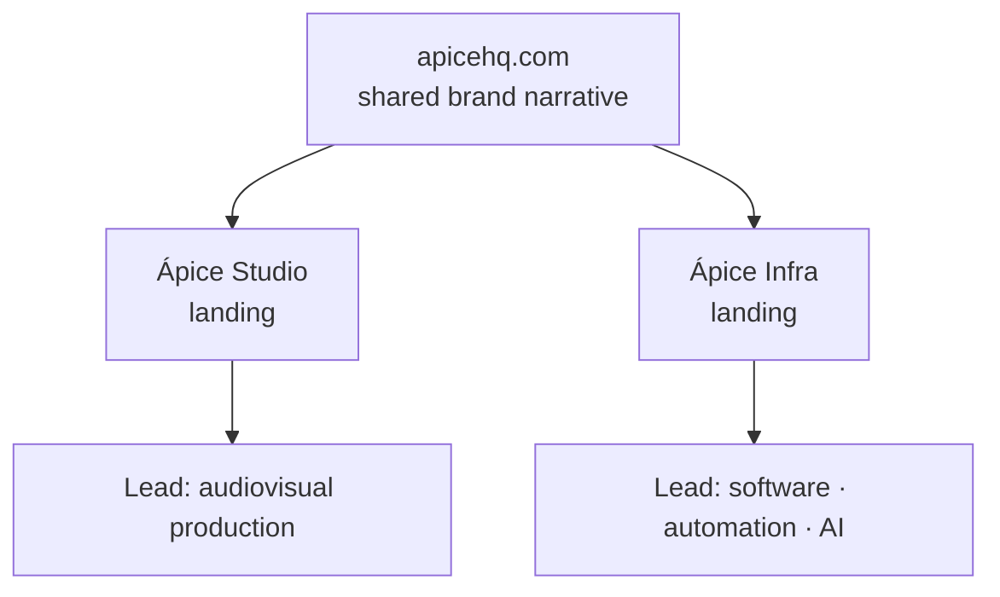

<TLDR>

- **What:** the website for [apicehq.com](https://apicehq.com): structure, design system and conversion strategy.
- **For:** Ápice HQ, the company I co-founded. I lead Ápice Infra.
- **Result:** <Todo>Carlo — headline number, e.g. mobile PageSpeed or share of leads per division</Todo>

</TLDR>

## Context

Ápice combines two distinct businesses under one brand: audiovisual production (**Ápice Studio**) and digital infrastructure, automation and AI (**Ápice Infra**).

## The problem

Communicate two lines of business without confusing the prospect. Someone looking for a video shouldn't get lost among automation services — and someone looking for automation shouldn't have to scroll past a showreel to find it.

## Architecture

- **Modular structure.** One landing page per division, each with its own funnel, tied together by a common brand narrative.
- **Visual direction.** Editorial typography, high contrast and restrained transitions, on a custom design system.
- **Accessibility.** Skip-to-content, an AA contrast hierarchy and semantic HTML.
- **Performance.** Deferred loading for video and heavy images — the site carries a lot of audiovisual material.

## Key decisions & trade-offs

<Decision title="Separate funnels per division" tradeoff="Two funnels to maintain and measure instead of one.">

Each lead arrives already classified — production or software — which simplifies the sale: the first conversation already starts in the right place.

</Decision>

<Decision title="A custom design system" tradeoff="More upfront design work than using a component library's defaults.">

Two divisions with different audiences need to look like one company. A shared system of type, color and components keeps them consistent without making them identical.

</Decision>

## The hard part

**A production company's site is heavy by nature.** Video and large images are the product, but they can't be allowed to make the site slow. The approach: defer loading of video and heavy images so they don't compete with what the visitor needs first.

<Todo>Carlo — technical details of the deferred loading (technique, formats, CDN)</Todo>

## Results

<Metrics>
  <Metric label="PageSpeed Insights · mobile" value="[TODO: Carlo]" />
  <Metric label="Leads per division" value="[TODO: Carlo]" />
  <Metric label="Contact form conversion" value="[TODO: Carlo]" />
</Metrics>

## Stack

<Stack>

- Next.js
- Material UI
- Custom design system

</Stack>

<Todo>Carlo — confirm the current stack and hosting/CDN</Todo>

<CTA />
