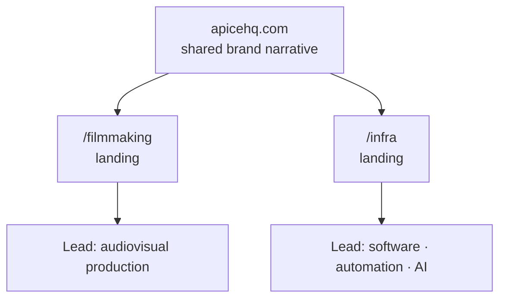

<TLDR>

- **What:** the website for [apicehq.com](https://apicehq.com): structure, design system, conversion strategy and the infrastructure it runs on.
- **For:** Ápice HQ, the company I co-founded. I lead Ápice Infra.
- **Result:** one landing page and funnel per division, and a perfect Lighthouse score for accessibility, best practices and SEO on mobile — on a site with a 3D hero.

</TLDR>

## Context

Ápice combines two distinct businesses under one brand: audiovisual production (**Ápice Filmmaking**) and digital infrastructure, automation and AI (**Ápice Infra**).

## The problem

Communicate two lines of business without confusing the prospect. Someone looking for a video shouldn't get lost among automation services — and someone looking for automation shouldn't have to scroll past a showreel to find it.

## Architecture

- **Modular structure.** One landing page per division, each with its own funnel, tied together by a common brand narrative and a shared contact page.
- **Visual direction.** Editorial typography, high contrast and restrained motion, on a custom design system built with React, Tailwind and Radix primitives.
- **Accessibility.** A skip-to-content link, visible focus rings that adapt to dark sections, ARIA on the navigation and mobile menu, a labeled contact form with a live status region, and `prefers-reduced-motion` respected across the site's animations.
- **Performance on a heavy site.** The 3D hero is split into its own chunk and loaded lazily, and its render loop pauses whenever it scrolls out of view. Images get multi-width WebP sets, `loading="lazy"` below the fold, `fetchpriority="high"` on the one that decides the largest paint, and explicit dimensions so nothing shifts while loading. Code is split per route.
- **Infrastructure.** A React single-page app where every route gets its own prerendered HTML file with its title, description and Open Graph tags, plus a preload of that route's code. It's served as static files by nginx behind Traefik on a VPS, with security headers, pre-compressed assets and self-hosted, cookieless analytics.

## Key decisions & trade-offs

<Decision title="Separate funnels per division" tradeoff="Two funnels to maintain and measure instead of one.">

Each lead arrives already classified — production or software — which simplifies the sale: the first conversation already starts in the right place.

</Decision>

<Decision title="A custom design system" tradeoff="More upfront design work than using a component library's defaults.">

Two divisions with different audiences need to look like one company. A shared system of type, color and components keeps them consistent without making them identical.

</Decision>

<Decision title="Static files with a prerendered head per route, instead of a server" tradeoff="Page bodies render in the browser, so they depend on JavaScript; every content change needs a build and a deploy.">

A marketing site doesn't need a server deciding anything per request. Google runs JavaScript, but the crawlers behind link previews on LinkedIn, WhatsApp, Slack and X don't — they only read the HTML — so each route ships its own file with its metadata already resolved. nginx serving static files is fast, cheap and hard to break.

</Decision>

<Decision title="Self-hosted analytics without cookies" tradeoff="One more service to run and back up.">

Umami, on our own server, measures traffic without cookies or persistent identifiers — so the site needs no consent banner, and visitor data doesn't go to a third party.

</Decision>

## The hard part

**After a deploy, returning visitors could get a blank page.**

**Why it happened.** Each route's `index.html` was served without a `Cache-Control` header. The deploy syncs files with `rsync`, which preserves modification times, so browsers applied heuristic caching and kept the old HTML. That old HTML pointed at JavaScript chunks with content hashes in their names — and the deploy's `--delete` had just removed them from the server. Old HTML, missing scripts: a blank page.

**The fix.** Two cache policies, decided by path:

- `/assets/` — content-hashed files whose name changes when their content does — are cached forever as `immutable`.
- Everything else (each route's HTML, the 404 page, `robots.txt`, the sitemap) is `no-cache, must-revalidate`: the browser can keep a copy, but must check it's current on every visit.

**The trap inside the fix.** In nginx, `add_header` isn't inherited by a `location` block that declares its own. Setting `Cache-Control` inside the two locations would have silently dropped every security header from exactly those responses — which is all of them. The policy is resolved with a `map` instead and emitted once at the server level, next to the security headers, so nothing is overridden.

## Results

<Metrics>
  <Metric label="Lighthouse · Accessibility (mobile)" value="100 / 100" note="Lighthouse 13, 3 runs, September 2026." />
  <Metric label="Lighthouse · Best Practices and SEO (mobile)" value="100 / 100" note="Same runs, both categories." />
  <Metric label="Cumulative Layout Shift" value="0" note="Same runs — every image has explicit dimensions." />
</Metrics>

## Stack

<Stack>

- React
- TypeScript
- Vite
- React Router
- Tailwind CSS · Radix
- GSAP
- three.js
- nginx · Traefik
- Umami

</Stack>

<CTA />
