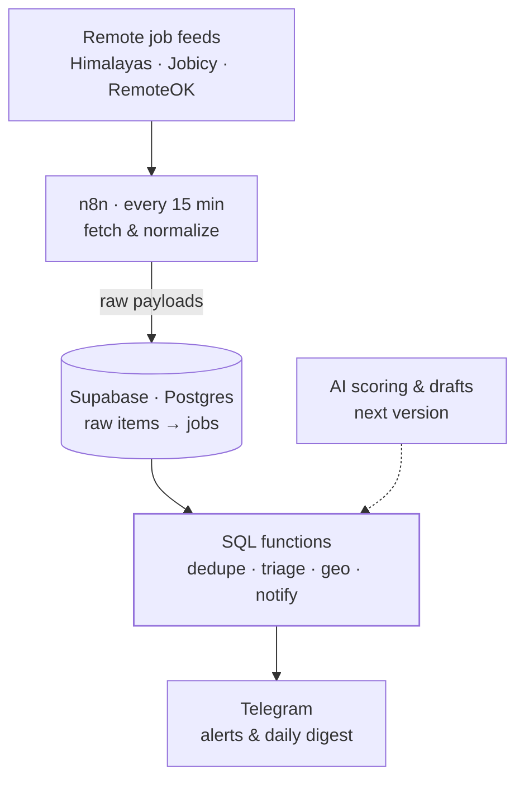

<TLDR>

- **What:** an internal tool that ingests remote job listings every 15 minutes, deduplicates and triages them in SQL, and alerts me on Telegram.
- **For:** me — this is the system I use to find work.
- **Result:** 1,197 listings ingested in its first three days, 27 passed triage — and measuring those 27 exposed a gap that a new rule closed, cutting the daily digest from about 9 listings to about 3.

</TLDR>

## Context

In remote work, timing matters: a good listing found late competes with everyone who found it first. Checking job boards by hand is slow, and most listings aren't a fit.

## The problem

I needed three things that generic job alerts don't do together:

1. **Find listings early**, as close as possible to when they're posted.
2. **Filter by fit**, not by keyword — with rules I can read, test and explain.
3. **Alert without noise**: the listings worth acting on right now, individually; the rest, once a day.

## Architecture



- **n8n — transport, not logic.** It fetches the feeds, normalizes each item and calls SQL functions to store the run and its raw payloads. When it's time to notify, it delivers messages whose text SQL already wrote.
- **Postgres SQL functions.** Every rule lives here: ingestion, deduplication, triage, the geo filter, what's worth an alert and what goes to the digest. Rules in SQL are versioned and tested as migrations, and they survive if the core ever moves out of n8n.
- **`canonical_hash`.** Deduplication runs on a hash that is a **generated column** in Postgres, with a unique constraint, so it's computed the same way for every row no matter which workflow inserted it.
- **Telegram, rate-limited.** One message at a time with a pause between them; on a `429` it waits the `retry_after` the API asks for and retries once. Caps per run — 3 individual alerts, 15 lines per digest — keep a burst of listings from becoming a burst of messages.

## Key decisions & trade-offs

<Decision title="n8n moves data; Postgres decides" tradeoff="Two places to look when debugging (the workflow and the database), and SQL is less approachable than a visual node.">

The boundary is strict: n8n moves data in and messages out; Postgres decides what everything means. The rules are versioned, testable and portable — they don't depend on the workflow tool.

</Decision>

<Decision title="The deduplication hash is a generated column" tradeoff="Changing the hash definition means migrating the column.">

Computing the hash in n8n meant every workflow had to compute it identically, forever. As a generated column, the database guarantees it — which removed an entire class of calculation bugs.

</Decision>

<Decision title="Trust in a listing's date is declared per source" tradeoff="Adding a source means classifying how reliable its dates are before it goes live.">

Some feeds publish exact timestamps, others approximate ones, others none. Each source is configured as `exact`, `approx` or `unknown`, and only an exact, recent date can trigger an individual alert.

</Decision>

<Decision title="Rules first, AI where rules run out" tradeoff="Until the AI layer ships, triage is only as smart as its rules.">

Rules are free, instant and explainable, and measuring them shows exactly where they fall short. The next version adds AI scoring and proposal drafts on top of them — only for listings that already passed the SQL filters, under a monthly budget cap.

</Decision>

## The hard part

**NULLs.** Two fields made them expensive.

**The canonical hash.** The obvious way to build it, `concat_ws`, silently skips NULL values — so fields shift position and different listings can produce the same string:

```sql
-- concat_ws skips NULLs, so values change position:
select concat_ws('|', 'a', null, 'b');  -- a|b
select concat_ws('|', 'a', 'b', null);  -- a|b   ← same result, different input

-- An explicit coalesce per field keeps every value in its slot:
select coalesce('a', '') || '|' || coalesce(null, '') || '|' || coalesce('b', '');  -- a||b
select coalesce('a', '') || '|' || coalesce('b', '') || '|' || coalesce(null, '');  -- a|b|
```

In a deduplication key, that collision means a real listing gets discarded as a duplicate. The generated column uses an explicit `coalesce` per field instead of `concat_ws`, then hashes the result with SHA-256.

**`posted_at`.** Early detection depends on knowing when something was posted. A missing value can't be quietly replaced with the ingestion time: an old listing would look brand-new and trigger an alert. So the two uses of the date are separated:

```sql
-- For the age filter, fall back to ingestion time only when the source's dates aren't trusted:
effective_posted_at := case
  when posted_at_confidence = 'unknown' then ingested_at
  else coalesce(posted_at, ingested_at)
end;

-- An individual alert needs an exact, recent date. A NULL posted_at makes the
-- comparison NULL, so it can never qualify: it falls through to the digest.
when posted_at_confidence = 'exact' and posted_at > now() - max_age then 'high'
```

## Results

Measured on 2026-09-24, over every listing ingested from September 21 onward.

<Metrics>
  <Metric label="Listings ingested in 3 days" value="1,197" note="Himalayas 552 · Jobicy 539 · RemoteOK 106 — roughly 400 a day." />
  <Metric label="Passed triage" value="27 (2.3%)" note="Everything else was filtered out automatically." />
  <Metric label="Passes I couldn't take from Mexico" value="18 of 27" note="Region-restricted listings. The measurement led to a geo rule based on each feed's structured location." />
  <Metric label="Daily digest, before → after the geo rule" value="~9 → ~3" note="Listings per day, on the same measured data." />
</Metrics>

## Stack

<Stack>

- n8n
- Supabase
- PostgreSQL · SQL functions
- pgcrypto (SHA-256)
- Telegram Bot API

</Stack>

<CTA />
