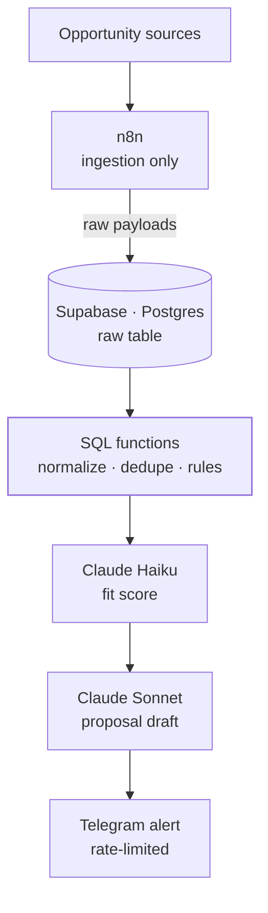

<TLDR>

- **What:** an internal tool that detects remote freelance opportunities early, qualifies them with AI and writes a first draft of the proposal.
- **For:** me — this is the system I use to find work.
- **Result:** <Todo>Carlo — headline number, e.g. opportunities processed per week or time from posting to alert</Todo>

</TLDR>

## Context

In freelance work, timing matters: a good opportunity found late competes with everyone who found it first. Checking sources by hand is slow, and most listings aren't a fit.

## The problem

I needed three things that generic job alerts don't do together:

1. **Find opportunities early**, as close as possible to when they're posted.
2. **Filter by fit**, not by keyword — with a score I can trust and explain.
3. **Get to a first draft fast**, so replying early doesn't mean replying badly.

And it had to run for almost nothing: every service inside a free tier at the current volume.

## Architecture



<Todo>Carlo — confirm the diagram matches production (what triggers scoring and drafting, and whether every opportunity is scored or only those that pass the SQL rules)</Todo>

- **n8n — ingestion only.** It fetches the sources and writes raw payloads to Supabase. It never touches business logic.
- **Postgres SQL functions.** Every rule lives here: normalization, deduplication, filtering. That's what makes a later move to a TypeScript core with Inngest possible without rewriting the rules.
- **`canonical_hash`.** Deduplication runs on a hash that is a **generated column** in Postgres, so it's computed the same way for every row, no matter which workflow inserted it.
- **Claude Haiku and Claude Sonnet.** Haiku scores, Sonnet drafts. The Batch API and prompt caching keep the cost down.
- **Telegram.** Notifications with rate-limit control, so a burst of new listings doesn't turn into a burst of messages.

## Key decisions & trade-offs

<Decision title="n8n only ingests; it never decides" tradeoff="Two places to look when debugging (the workflow and the database), and SQL is less approachable than a visual node.">

The boundary is strict: n8n moves data in, Postgres decides what it means. Rules in SQL functions are versioned, testable and portable — and they'll survive the planned move to a TypeScript core with Inngest.

</Decision>

<Decision title="The deduplication hash is a generated column" tradeoff="Changing the hash definition means migrating the column.">

Computing the hash in n8n meant every workflow had to compute it identically, forever. As a generated column, the database guarantees it — which removed an entire class of calculation bugs.

</Decision>

<Decision title="A small model to score, a larger one to write" tradeoff="Two prompts to maintain and evaluate instead of one.">

Scoring runs on every new opportunity, so it uses Claude Haiku. Writing a proposal needs better prose, so it uses Claude Sonnet. The Batch API and prompt caching cut the cost of both.

</Decision>

<Decision title="Temporal Cloud ruled out; everything in free tiers" tradeoff="Fewer durable-execution guarantees than a workflow engine — acceptable at this volume, revisited when it grows.">

Temporal Cloud was too expensive for a tool at this stage. The whole system runs inside free tiers at the current volume.

</Decision>

## The hard part

**NULLs.** Two fields made them expensive.

**The canonical hash.** The obvious way to build it, `concat_ws`, silently skips NULL values — so fields shift position and different listings can produce the same string:

```sql
-- concat_ws skips NULLs, so values change position:
select concat_ws('|', 'a', null, 'b');  -- a|b
select concat_ws('|', 'a', 'b', null);  -- a|b   ← same result, different input

-- An explicit coalesce per field keeps every value in its slot:
select coalesce('a', '') || '|' || coalesce(null, '') || '|' || coalesce('b', '');  -- a||b
select coalesce('a', '') || '|' || coalesce('b', '') || '|' || coalesce(null, '');  -- a|b|
```

In a deduplication key, that collision means a real opportunity gets discarded as a duplicate. The fix was an explicit `coalesce` per field instead of `concat_ws`.

**`posted_at`.** Early detection depends on knowing when something was posted. A missing value can't be quietly replaced with the ingestion time: an old listing would look brand-new and trigger an alert. <Todo>Carlo — how NULL posted_at values are handled</Todo>

## Results

<Metrics>
  <Metric label="Opportunities processed / week" value="[TODO: Carlo]" />
  <Metric label="Filtered out automatically" value="[TODO: Carlo]" />
  <Metric label="Real LLM cost / month" value="[TODO: Carlo]" />
  <Metric label="Time from posting to alert" value="[TODO: Carlo]" />
</Metrics>

## Stack

<Stack>

- n8n
- Supabase
- PostgreSQL · SQL functions
- Claude Haiku
- Claude Sonnet
- Anthropic Batch API
- Prompt caching
- Telegram Bot API

</Stack>

<CTA />
