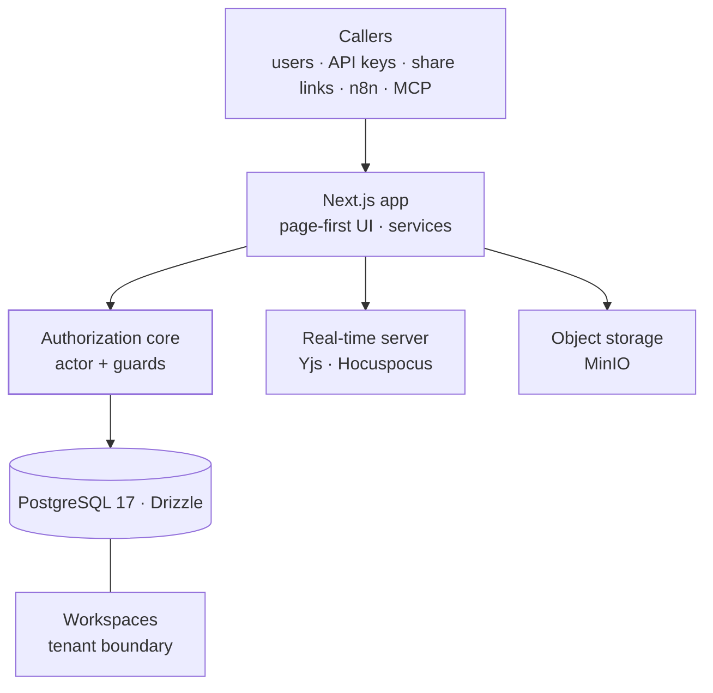

<TLDR>

- **What:** a modular, multi-tenant platform — bases, tables, records, views and pages with real-time co-editing — built with Next.js, TypeScript, Drizzle and self-hosted Postgres. It's in development; this is an architecture case, not a product launch.
- **For:** the layer that turns vertical agents into a product many businesses can use. [Hanami](/work/hanami)'s appointments and color requests are already being moved onto it from Airtable.
- **Result:** 18 server actions audited with none missing an authorization guard, and the owner bypass turned from hand-copied code into one named rule enforced by lint.

</TLDR>

## Context

An agent built for one client, like HanamiBot, proves the idea works. Offering it to many businesses is a different problem: tenants, accounts, permissions, configuration and an interface each business can run on its own. Corebase is the platform layer for that.

## The problem

A custom deployment per client doesn't scale. The platform needs to keep each business's data isolated, let new verticals plug in without new apps, and stay small enough for a small team to maintain.

## Architecture

- **Actors.** Every request is resolved to one actor: an agency admin, a client user with their workspace memberships, an API key, a share link or the system. Authorization rules are written once against that model.
- **Authorization core.** Guards such as `requireWorkspaceAccess` and `requireStructureEditor` are the only way a service reaches data. See [the hard part](#the-hard-part).
- **Workspaces.** The tenant boundary. Members have a role — viewer, editor or owner — and objects can carry grants that hide them or make them read-only.
- **Page-first.** The page is the universal container: bases, tables and views live inside pages, and permissions are inherited down the page tree.
- **Real-time and files.** Co-editing runs on a separate Yjs + Hocuspocus server; files go to MinIO.
- **Integrations.** API keys, webhooks, an MCP server and a custom n8n node — the node is how Hanami's workflows write into it.

## Key decisions & trade-offs

<Decision title="Consolidate: Corebase as the only trunk" tradeoff="Useful code from the earlier project has to be ported by hand, and that project no longer gets fixes.">

An earlier project, Synaptic, overlapped with Corebase. Instead of maintaining both, Corebase became the single trunk and Synaptic was frozen.

</Decision>

<Decision title="Page-first architecture, Notion-style" tradeoff="A generic page model is harder to design up front than a set of fixed screens.">

Pages are the primary unit of the product. New functionality arrives as something that lives inside a page instead of a new, separate section of the app — and permissions follow the page tree instead of being configured per screen.

</Decision>

<Decision title="Tenant isolation in the application, not in database policies" tradeoff="The database won't stop a query that skips the guards, so the guards themselves need audits, lint rules and tests.">

Services derive the workspace from the record they load and check the actor against it before returning anything. One authorization model covers every kind of caller — including API keys and share links, which aren't database users.

</Decision>

<Decision title="Mobile deferred until there's revenue" tradeoff="No native app for now; mobile users get the web app.">

A React Native / Expo app would double the surface to build and maintain. It waits until the platform has revenue — an explicit business decision, not an oversight.

</Decision>

## The hard part

**One raw predicate was answering three different questions.** An audit of permissions found `isWorkspaceOwner` at 42 call sites across the codebase, and the owner bypass — "agency admin or workspace owner" — written by hand in six places, two of them in the UI.

**Why that was a risk.**

- Each call site was really asking one of three things: *is this person an end client subject to the portal's rules?*, *can this person operate the workspace?*, or *what access level does this object have for them?* The same function answered all three, so reading the code didn't tell you which one was meant.
- A rule written on both sides of the client/server boundary drifts. The day it drifts, the UI promises a gate the server doesn't enforce.
- In a multi-tenant platform, a wrong check isn't a small bug: it's one business seeing another business's data.

**The final design.**

1. **Each question got a name** in the authorization core: `isPortalSubject`, `isWorkspaceAdmin` and `effectiveObjectLevelFor`. The six hand-written bypasses became `isWorkspaceAdmin`.
2. **A lint rule restricts the raw predicate** to an allowlist. Adding a caller means editing that list and justifying it in the diff — the rule fails exactly when someone forgets, which is what the first refactor was missing.
3. **An HTTP smoke test covers the one gate no service test could reach.** Its oracle is the rendered HTML, not the status code: the page streams, so the response is already `200` when access is denied — a test asserting `404` would pass with the gate wide open. It was checked by sabotaging the gate on purpose.

## Results

Corebase is in development, so there are no production metrics yet. What the refactor and the audit left in place:

<Metrics>
  <Metric label="Server actions without an authorization guard" value="0 of 18" note="From the permissions audit." />
  <Metric label="Hand-written owner bypasses" value="6 → 1 named rule" note="Replaced by isWorkspaceAdmin; new direct uses of the raw predicate fail lint." />
  <Metric label="Service smoke checks after the refactor" value="906 · 0 failures" note="Across 15 smoke suites, plus 19/19 on the new HTTP smoke test." />
</Metrics>

## Stack

<Stack>

- TypeScript
- Next.js
- React
- PostgreSQL 17
- Drizzle ORM
- Yjs · Hocuspocus
- BlockNote
- MinIO
- Tailwind CSS
- MCP

</Stack>

<CTA />
