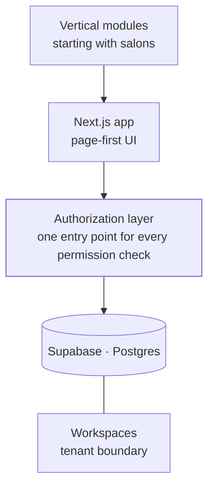

<Todo>Carlo — "Corebase" is a working name; decide whether to publish under it</Todo>

<TLDR>

- **What:** a modular, multi-tenant SaaS platform built with TypeScript, Next.js and Supabase. It's in development; this is an architecture case, not a product launch.
- **For:** the layer that turns vertical agents into a product many businesses can use — starting with hair salons, with [Hanami](/work/hanami) as the proof.
- **Result:** one codebase instead of two, and 42 scattered permission checks consolidated into a single authorization layer.

</TLDR>

## Context

An agent built for one client, like HanamiBot, proves the idea works. Offering it to many businesses is a different problem: tenants, accounts, permissions, configuration and an interface each business can run on its own. Corebase is the platform layer for that.

## The problem

A custom deployment per client doesn't scale. The platform needs to keep each business's data isolated, let new verticals plug in without new apps, and stay small enough for a small team to maintain.

## Architecture

- **Next.js app (TypeScript).** A page-first interface in the style of Notion.
- **Authorization layer.** The single place where the platform decides who can do what. See [the hard part](#the-hard-part).
- **Supabase.** Postgres and authentication.
- **Workspaces.** The tenant boundary: each business works inside its own workspace.
- **Vertical modules.** Industry-specific functionality, starting with salons.

<Todo>Carlo — multi-tenant isolation details: Supabase RLS policies and the workspace schema</Todo>

<Todo>Carlo — screenshots</Todo>

## Key decisions & trade-offs

<Decision title="Consolidate: Corebase as the trunk, Synaptic as a frozen code donor" tradeoff="Useful code in Synaptic has to be ported by hand, and Synaptic no longer gets fixes.">

An earlier project, Synaptic, overlapped with Corebase. Instead of maintaining both, Corebase became the single trunk and Synaptic was frozen: code is taken from it when it's needed, and nothing new is built there.

</Decision>

<Decision title="Page-first architecture, Notion-style" tradeoff="A generic page model is harder to design up front than a set of fixed screens.">

Pages are the primary unit of the product. New functionality arrives as something that lives inside a page instead of a new, separate section of the app.

</Decision>

<Decision title="Multi-tenant isolation by workspace">

<Todo>Carlo — how isolation is enforced (Supabase RLS, workspace schema) and why</Todo>

</Decision>

<Decision title="Mobile deferred until there's revenue" tradeoff="No native app for now; mobile users get the web app.">

A React Native / Expo app in the monorepo is planned, but it would double the surface to build and maintain. It waits until the platform has revenue — an explicit business decision, not an oversight.

</Decision>

## The hard part

**Permissions were scattered across the codebase: 42 separate calls to `isOwner` and `isWorkspaceOwner`.**

**Why that was a risk.**

- Each feature decided on its own who could do what. Adding a feature meant remembering to add the right check — and nothing failed if you forgot.
- Two helpers with overlapping meanings made it easy to use the wrong one: owner of the resource, or owner of the workspace?
- In a multi-tenant platform, a missing check isn't a small bug: it's one business seeing another business's data.
- Answering "who can do X?" meant reading 42 call sites.

**The final design.** Every check now goes through a single authorization layer. Features ask one question — *can this user perform this action here?* — and the answer comes from one place that can be read, reviewed and tested on its own.

<Todo>Carlo — details of the final design (the layer's API, how roles are modeled, whether it's backed by RLS)</Todo>

## Results

Corebase is in development, so there are no production metrics yet.

<Metrics>
  <Metric label="Permission checks" value="42 → 1 layer" note="Scattered isOwner / isWorkspaceOwner calls consolidated into a single authorization layer." />
  <Metric label="Active codebases" value="2 → 1" note="Synaptic frozen as a code donor; Corebase is the only trunk." />
</Metrics>

## Stack

<Stack>

- TypeScript
- Next.js
- Supabase
- PostgreSQL
- React Native · Expo (planned)

</Stack>

<CTA />
