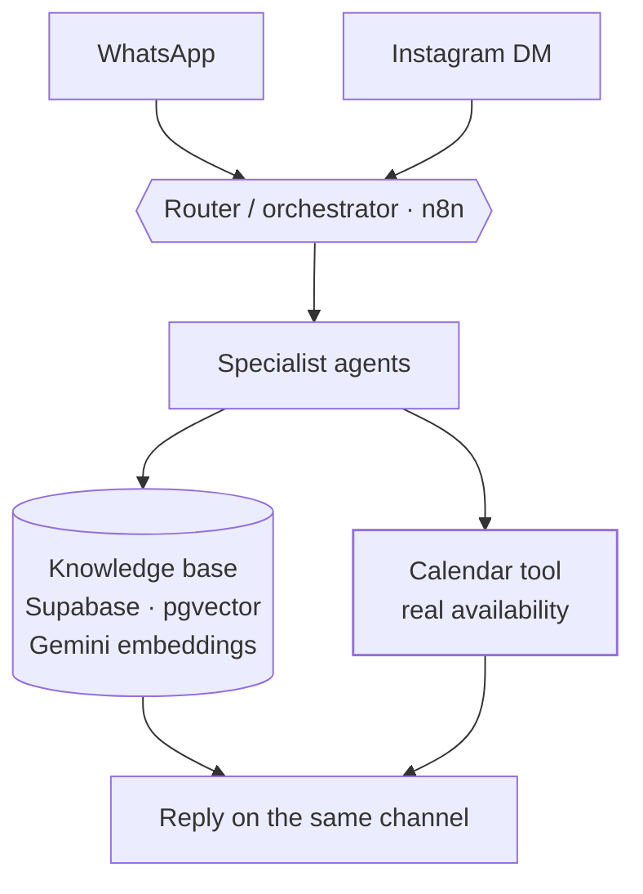

<Todo>Carlo — confirm Hanami agrees to appear by name and with screenshots</Todo>

<TLDR>

- **What:** a website (hanamihairstudio.com) and a booking agent (HanamiBot), designed as one system.
- **For:** Hanami Hair Studio, a salon in the historic center of Zacatecas, Mexico, and a real Ápice client.
- **Result:** <Todo>Carlo — headline number, e.g. bookings made by the bot per month or % of conversations resolved without a human</Todo>

</TLDR>

## Context

Hanami is a hair salon in the historic center of Zacatecas with a clear philosophy: natural, inclusive styling. Clients discover it on Instagram and arrive on their phones — first to look, then to ask by DM or WhatsApp.

## The problem

<Todo>Carlo — message volume, response time before the bot, missed appointments and load on the front desk</Todo>

Most conversations started with the same questions — prices, how long a session takes, what's needed before a color service, the deposit — before reaching the one that matters: *is there a slot?*

A generic chatbot wasn't enough. Answers had to match the salon's real prices and policies, and availability had to match the real calendar. In booking, a wrong answer is worse than no answer: a client who shows up for a slot that doesn't exist is a client you lose.

## Architecture

The system has two surfaces with a clear split. **The site answers the static questions** (prices, policies, what to expect). **The bot handles the dynamic ones** (availability and booking).

<Todo>Carlo — confirm whether the site links to or opens the bot directly, and how</Todo>

### HanamiBot

- **Channels.** WhatsApp and Instagram DMs enter the same pipeline, so the salon has one set of rules instead of two.
- **Router / orchestrator (n8n).** Decides which specialist agent handles each message.
- **Specialist agents.** Each has a narrow job, which keeps prompts short and behavior predictable.
- **Knowledge base (RAG).** Services, prices and policies live in Supabase with pgvector and Gemini embeddings, and are retrieved when answering — not baked into prompts.
- **Calendar tool.** The only source of availability. See [the hard part](#the-hard-part) for why that's a rule, not a preference.

<Todo>Carlo — which calendar or booking system the tool reads from and writes to</Todo>

### The website

hanamihairstudio.com is a one-page site built with semantic HTML, utility-first CSS and vanilla JavaScript — no framework.

- **Booking information up front.** Prices, session length, requirements for color services and the deposit policy are visible before anyone gets in touch. The goal: clients reach the DM or the bot already qualified, without repeating questions.
- **Before/after gallery.** A lightweight carousel with WebP/AVIF images: social proof without giving up speed.
- **Local SEO.** On-page optimization for the historic center of Zacatecas and Schema.org structured data (`HairSalon` / `LocalBusiness`) with geolocation and opening hours.
- **Editorial visual tone**, aligned with the salon's natural, inclusive approach.

### QA and monitoring

The bot shipped with three separate workflows around it, because agents fail quietly — a confident wrong answer doesn't throw an error.

- **Logger** — keeps a record of the bot's conversations and decisions so any problem can be traced.
- **Error Watchdog** — catches failed executions and raises an alert.
- **QA Digest** — a periodic summary to review how the bot is behaving.

<Todo>Carlo — confirm what each workflow records, where alerts go and how often the QA Digest runs</Todo>

## Key decisions & trade-offs

<Decision title="One system, two surfaces" tradeoff="Salon information lives in two places (the site and the knowledge base) and has to be kept in sync.">

Static questions are answered on the site, where they're free and instant. The bot only spends conversation turns on what a page can't answer: availability and booking.

</Decision>

<Decision title="No framework for the site" tradeoff="No component system; fine for one page, but a larger site would need one.">

Clients arrive from Instagram on their phones. Semantic HTML, utility-first CSS and vanilla JavaScript mean zero unnecessary JavaScript to download before the page is usable.

</Decision>

<Decision title="Availability comes from a tool, never from the model" tradeoff="Every availability answer costs a tool call, and the bot can't answer when the calendar is unreachable.">

The model is good at conversation and bad at facts it can't see. Availability is always read from the real calendar through a tool; the model only phrases the answer.

</Decision>

<Decision title="Router plus specialist agents instead of one large agent" tradeoff="More workflows to maintain, and the router becomes a critical piece.">

Each agent has a narrow job and a short prompt, which makes it easier to test, debug and change one behavior without breaking the others.

</Decision>

<Decision title="QA and monitoring from day one" tradeoff="More workflows to build before launch.">

Logger, Error Watchdog and QA Digest are separate workflows, not an afterthought. It's the difference between a demo and a system a business can depend on.

</Decision>

## The hard part

**The agent invented appointment times.** It offered slots that sounded plausible but weren't in the calendar.

**How it was detected.** <Todo>Carlo — how it was caught (client report, logs, QA Digest…)</Todo>

**Root cause.** The model could answer availability questions without consulting the calendar — and when it skipped the tool, it filled the gap with times that looked right. <Todo>Carlo — confirm and add the exact details</Todo>

**The fix.** Availability now always comes from a tool call against the real calendar; the agent can't offer a slot the tool didn't return. <Todo>Carlo — exact details of the fix (prompt rules, forced tool call, validation step…)</Todo>

The lesson generalizes to any booking agent: the calendar is the source of truth, and the LLM is only the interface to it.

## Results

### HanamiBot

<Metrics>
  <Metric label="Bookings made by the bot / month" value="[TODO: Carlo]" />
  <Metric label="Conversations resolved without a human" value="[TODO: Carlo]" />
  <Metric label="Response time" value="[TODO: Carlo]" />
  <Metric label="Uptime" value="[TODO: Carlo]" />
</Metrics>

### Website

<Metrics>
  <Metric label="PageSpeed Insights · mobile performance" value="[TODO: Carlo]" />
  <Metric label="LCP · mobile" value="[TODO: Carlo]" />
  <Metric label="Position in Google / Maps for local searches" value="[TODO: Carlo]" />
  <Metric label="Repeated questions avoided (salon's estimate)" value="[TODO: Carlo]" />
</Metrics>

<Todo>Carlo — screenshots or a short video of HanamiBot in action (a real, anonymized conversation)</Todo>

## Stack

<Stack>

- n8n
- Supabase
- PostgreSQL + pgvector
- Gemini embeddings
- WhatsApp
- Instagram
- HTML · CSS · JavaScript
- Schema.org

</Stack>

<Todo>Carlo — LLM model(s) used by the agents</Todo>

<CTA />
