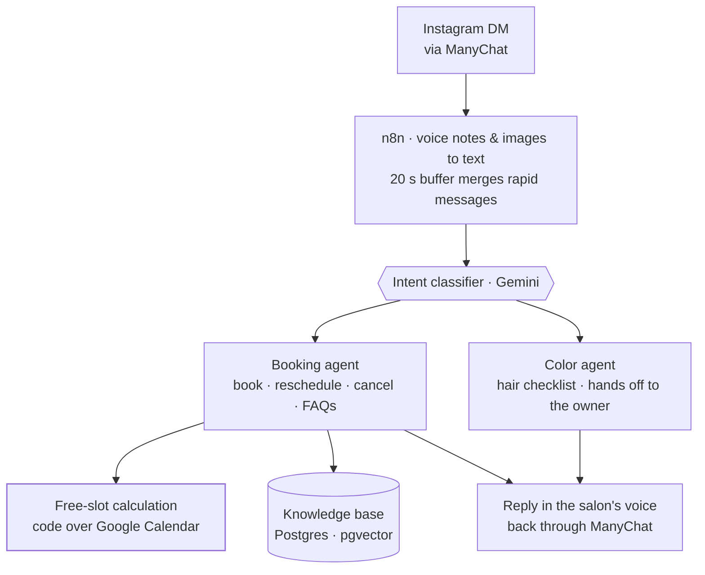

<TLDR>

- **What:** a website (hanamihairstudio.com) and a booking assistant on Instagram (HanamiBot), designed as one system.
- **For:** Hanami Hair Studio, a salon in the historic center of Zacatecas, Mexico, and a real Ápice client.
- **Result:** the bot has handled the salon's Instagram DMs since December 2025, now in its third major version — with availability computed by code, never guessed by the model.

</TLDR>

## Context

Hanami is a hair salon in the historic center of Zacatecas with a clear philosophy: natural, inclusive styling. Clients discover it on Instagram and arrive on their phones — first to look, then to ask by DM.

## The problem

Most conversations started with the same questions — prices, how long a session takes, what's needed before a color service, the deposit — before reaching the one that matters: *is there a slot?*

A generic chatbot wasn't enough. Answers had to match the salon's real prices and policies, and availability had to match the owner's real calendar. In booking, a wrong answer is worse than no answer: a client who shows up for a slot that doesn't exist is a client you lose.

## Architecture

The system has two surfaces with a clear split. **The site answers the static questions** (prices, policies, what to expect). **The bot handles the dynamic ones** (availability and booking). They meet in one place: every "book" button on the site opens an Instagram DM with the bot.

### HanamiBot

- **Channel.** Instagram DMs reach n8n through ManyChat, and replies go back the same way.
- **Pre-processing.** Voice notes are transcribed and images described with Gemini, and a 20-second buffer merges messages that arrive in a burst, so the agent answers the whole thought instead of every fragment.
- **Classifier and router.** A Gemini classifier labels each conversation's intent and a router hands it to one specialist agent.
- **Booking agent.** Books, reschedules and cancels in the owner's Google Calendar, and answers questions about services, prices and policies from a knowledge base in Postgres with pgvector.
- **Color agent.** Color services need a consultation, so this agent collects a five-point checklist about the client's hair, saves it and hands the conversation to the owner. It never quotes a final price.
- **Free-slot calculation.** The only source of availability. See [the hard part](#the-hard-part) for why that's code, not a prompt.
- **Voice.** A last step rewrites each reply in the salon's tone before it's sent.

### The website

hanamihairstudio.com is a React and TypeScript single page built with Vite and Tailwind, **prerendered to static HTML** at build time, so the content is in the page before any JavaScript runs.

- **Booking information up front.** Prices, session length, opening hours, payment methods and the deposit policy for color services are on the page before anyone gets in touch. The goal: clients reach the DM already qualified, without repeating questions.
- **Every call to action opens the bot.** "Book" buttons are Instagram DM deep links, so the site hands off to the bot instead of to a contact form.
- **Before/after gallery.** A scroll-snap carousel on mobile and a grid on desktop, with its animation skipped for visitors who prefer reduced motion.
- **Local SEO.** Schema.org `HairSalon` structured data with the address, opening hours, price range and a catalog of services.

### QA and monitoring

Agents fail quietly — a confident wrong answer doesn't throw an error — so the bot has workflows around it whose only job is to watch it.

- **Error handler** (running). Every failed execution in the Hanami workflows is saved to an error log and raises an alert on Telegram.
- **Per-turn telemetry.** Each turn records the intent, latency, the tools used and whether it fell back — including a flag for *mentioned a time without checking the calendar*. In the newest version it's written before the DM is sent, so a failed send can't erase the record.
- **Nightly evaluator and daily digest** (built for the v3 cut-over, currently in staging). At 2 a.m. an LLM judge scores the day's conversations on tone, resolution, price hallucination, handoff and close; at 9 a.m. a digest with technical health, a per-agent breakdown and business numbers goes to Telegram.

## Key decisions & trade-offs

<Decision title="One system, two surfaces" tradeoff="Salon information lives in two places (the site and the knowledge base) and has to be kept in sync.">

Static questions are answered on the site, where they're free and instant. The bot only spends conversation turns on what a page can't answer: availability and booking.

</Decision>

<Decision title="Availability is computed by code, never by the model" tradeoff="Every change to the salon's hours is a code change, and the bot can't offer a slot when the calendar is unreachable.">

The model is good at conversation and bad at date arithmetic it can't see. Free slots are calculated deterministically and handed to the model as a closed list; the model only phrases the answer.

</Decision>

<Decision title="A router plus specialist agents instead of one large agent" tradeoff="More workflows to maintain, and the classifier becomes a critical piece.">

Booking and color consultations need different rules — one closes a sale, the other must not quote a price. Separate agents with short prompts are easier to test and change without breaking each other.

</Decision>

<Decision title="Prerender the site to static HTML" tradeoff="A build step that renders every page, and the page still downloads React to become interactive.">

Visitors arrive from Instagram on their phones, and search engines need to read prices and hours. Prerendering puts all the content in the HTML while keeping the site's React components.

</Decision>

<Decision title="Monitoring is part of the system, not an add-on" tradeoff="More workflows to build and keep running around a single bot.">

Error alerts and per-turn telemetry are separate workflows with their own tables. It's the difference between a demo and a system a business can depend on.

</Decision>

## The hard part

**The agent offered appointment times that didn't exist.**

**How it was detected.** The salon's owner reported it: the bot got the month wrong and offered slots that weren't actually free, then had to take them back.

**Root cause.** The earlier version handed the model raw calendar events and asked it to work out the free slots itself — subtracting busy events from opening hours, handling the time zone, and even keeping to a month that was hard-coded in the prompt. That's arithmetic, and a language model does arithmetic by guessing what looks right.

**The fix.** The model no longer computes anything about time:

1. A code step calculates the free 60-minute slots in the `America/Mexico_City` time zone: opening hours minus busy events, with a 24-hour minimum notice, over the next 14 days.
2. The list goes into the prompt with exact ISO timestamps and today's date, under one rule: *you may only offer times that appear in this list.*
3. To book, the agent copies the ISO value of the chosen slot into the booking tool — it never types a date on its own.

The calculation later became a reusable sub-workflow — the single source of truth for availability — and telemetry now flags any turn that mentions a time without having checked the calendar.

The lesson generalizes to any booking agent: the calendar is the source of truth, and the LLM is only the interface to it.

## Results

<Metrics>
  <Metric label="Handling the salon's Instagram DMs since" value="Dec 2025" note="Book, reschedule and cancel, directly in the owner's calendar." />
  <Metric label="Major versions in production" value="3" note="The third made availability deterministic and added parameterized SQL and payload validation." />
  <Metric label="Website · Lighthouse SEO (mobile)" value="100 / 100" note="Lighthouse 13, 3 runs, September 2026." />
  <Metric label="Website · Lighthouse Best Practices (mobile)" value="100 / 100" note="Same runs." />
</Metrics>

## Stack

<Stack>

- n8n
- Gemini (agents, classifier, embeddings)
- ManyChat · Instagram
- Google Calendar
- PostgreSQL + pgvector
- Airtable
- Telegram (alerts)
- React · TypeScript · Vite
- Tailwind CSS
- Schema.org

</Stack>

<CTA />
