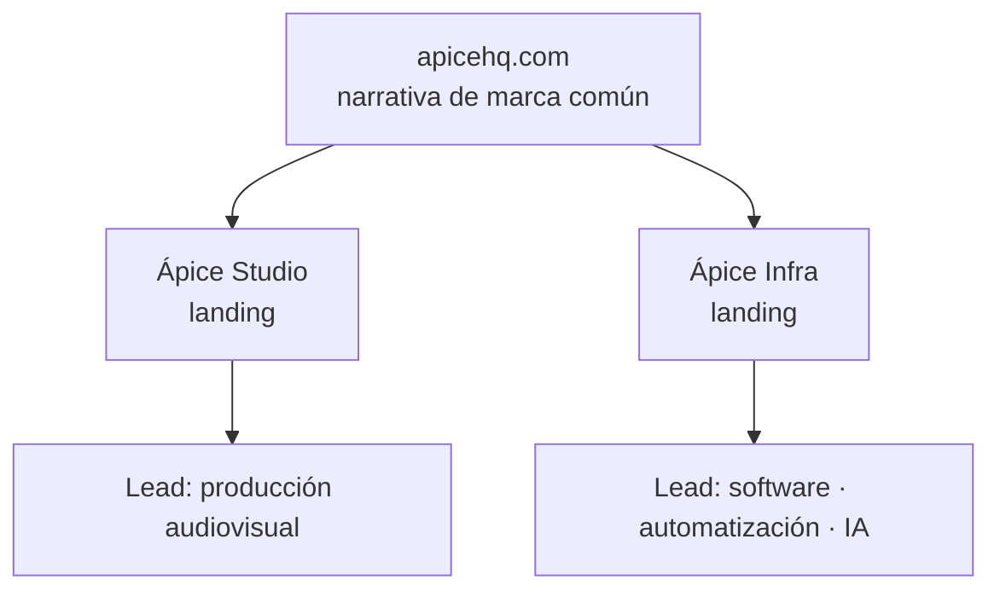

<TLDR>

- **Qué es:** el sitio de [apicehq.com](https://apicehq.com): estructura, sistema de diseño y estrategia de conversión.
- **Para quién:** Ápice HQ, la empresa que cofundé. Lidero Ápice Infra.
- **Resultado:** <Todo>Carlo — número principal, p. ej. PageSpeed móvil o % de leads por división</Todo>

</TLDR>

## Contexto

Ápice combina dos negocios distintos bajo una marca: producción audiovisual (**Ápice Studio**) e infraestructura digital, automatización e IA (**Ápice Infra**).

## El problema

Comunicar dos líneas de negocio sin confundir al prospecto. Quien busca un video no debería perderse entre servicios de automatización — y quien busca automatización no debería tener que pasar por un showreel para encontrarla.

## Arquitectura

- **Estructura modular.** Una landing por división, cada una con su propio embudo, unidas por una narrativa de marca común.
- **Dirección visual.** Tipografía editorial, alto contraste y transiciones sobrias, sobre un sistema de diseño propio.
- **Accesibilidad.** Skip-to-content, jerarquía de contraste AA y HTML semántico.
- **Rendimiento.** Carga diferida de video e imágenes pesadas — el sitio tiene mucho material audiovisual.

## Decisiones clave y trade-offs

<Decision title="Embudos separados por división" tradeoff="Dos embudos que mantener y medir en vez de uno.">

Cada lead llega ya clasificado — producción o software — lo que simplifica la venta: la primera conversación ya empieza en el lugar correcto.

</Decision>

<Decision title="Un sistema de diseño propio" tradeoff="Más trabajo de diseño al inicio que usar los estilos por defecto de una librería de componentes.">

Dos divisiones con públicos distintos tienen que verse como una sola empresa. Un sistema compartido de tipografía, color y componentes las mantiene consistentes sin hacerlas idénticas.

</Decision>

## La parte difícil

**El sitio de una productora es pesado por naturaleza.** El video y las imágenes grandes son el producto, pero no pueden volver lento el sitio. El enfoque: diferir la carga de video e imágenes pesadas para que no compitan con lo que el visitante necesita primero.

<Todo>Carlo — detalles técnicos de la carga diferida (técnica, formatos, CDN)</Todo>

## Resultados

<Metrics>
  <Metric label="PageSpeed Insights · móvil" value="[TODO: Carlo]" />
  <Metric label="Leads por división" value="[TODO: Carlo]" />
  <Metric label="Conversión del formulario de contacto" value="[TODO: Carlo]" />
</Metrics>

## Stack

<Stack>

- Next.js
- Material UI
- Sistema de diseño propio

</Stack>

<Todo>Carlo — confirmar el stack actual y el hosting/CDN</Todo>

<CTA />
