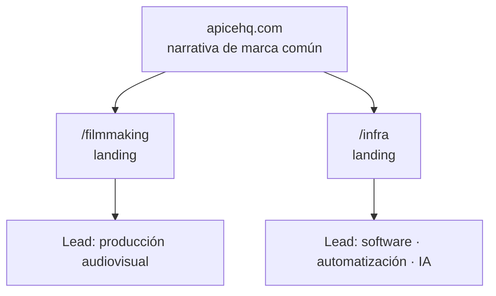

<TLDR>

- **Qué es:** el sitio de [apicehq.com](https://apicehq.com): estructura, sistema de diseño, estrategia de conversión y la infraestructura donde corre.
- **Para quién:** Ápice HQ, la empresa que co-fundé. Lidero Ápice Infra.
- **Resultado:** una landing y un embudo por división, y calificación perfecta de Lighthouse en accesibilidad, buenas prácticas y SEO en móvil — en un sitio con un hero en 3D.

</TLDR>

## Contexto

Ápice combina dos negocios distintos bajo una marca: producción audiovisual (**Ápice Filmmaking**) e infraestructura digital, automatización e IA (**Ápice Infra**).

## El problema

Comunicar dos líneas de negocio sin confundir al prospecto. Quien busca un video no debe perderse entre servicios de automatización — y quien busca automatización no debería tener que pasar por un showreel para encontrarla.

## Arquitectura

- **Estructura modular.** Una landing por división, cada una con su propio embudo, unidas por una narrativa de marca común y una página de contacto compartida.
- **Dirección visual.** Tipografía editorial, alto contraste y movimiento sobrio, sobre un sistema de diseño propio construido con React, Tailwind y primitivas de Radix.
- **Accesibilidad.** Enlace para saltar al contenido, anillos de foco visibles que se adaptan a las secciones oscuras, ARIA en la navegación y el menú móvil, un formulario de contacto con etiquetas y una región de estado anunciada, y `prefers-reduced-motion` respetado en las animaciones del sitio.
- **Rendimiento en un sitio pesado.** El hero en 3D va en su propio chunk y se carga de forma diferida, y su loop de render se pausa cuando sale de la pantalla. Las imágenes tienen sets WebP en varios anchos, `loading="lazy"` debajo del primer pantallazo, `fetchpriority="high"` en la que define el pintado más grande y dimensiones explícitas para que nada se mueva al cargar. El código se divide por ruta.
- **Infraestructura.** Una app React de una sola página donde cada ruta tiene su propio HTML prerenderizado con título, descripción y etiquetas Open Graph, más la precarga del código de esa ruta. Se sirve como archivos estáticos con nginx detrás de Traefik en un VPS, con cabeceras de seguridad, assets precomprimidos y analítica propia sin cookies.

## Decisiones clave y trade-offs

<Decision title="Embudos separados por división" tradeoff="Dos embudos que mantener y medir en lugar de uno.">

Cada lead llega ya clasificado — producción o software — y eso simplifica la venta: la primera conversación ya empieza en el lugar correcto.

</Decision>

<Decision title="Un sistema de diseño propio" tradeoff="Más trabajo de diseño de entrada que usar los defaults de una librería de componentes.">

Dos divisiones con audiencias distintas tienen que verse como una sola empresa. Un sistema compartido de tipografía, color y componentes las mantiene consistentes sin hacerlas idénticas.

</Decision>

<Decision title="Archivos estáticos con un head prerenderizado por ruta, en lugar de un servidor" tradeoff="El cuerpo de las páginas se renderiza en el navegador, así que depende de JavaScript; cada cambio de contenido necesita un build y un deploy.">

Un sitio de marketing no necesita un servidor que decida algo en cada request. Google ejecuta JavaScript, pero los crawlers de las vistas previas de LinkedIn, WhatsApp, Slack y X no — solo leen el HTML — así que cada ruta publica su propio archivo con sus metadatos ya resueltos. nginx sirviendo archivos estáticos es rápido, barato y difícil de romper.

</Decision>

<Decision title="Analítica propia y sin cookies" tradeoff="Un servicio más que operar y respaldar.">

Umami, en nuestro propio servidor, mide el tráfico sin cookies ni identificadores persistentes — así que el sitio no necesita banner de consentimiento, y los datos de los visitantes no se van a un tercero.

</Decision>

## La parte difícil

**Después de un deploy, quien volvía al sitio podía ver una página en blanco.**

**Por qué pasaba.** El `index.html` de cada ruta se servía sin cabecera `Cache-Control`. El deploy sincroniza archivos con `rsync`, que conserva las fechas de modificación, así que el navegador aplicaba caché heurística y se quedaba con el HTML viejo. Ese HTML apuntaba a chunks de JavaScript con un hash de contenido en el nombre — y el `--delete` del deploy los acababa de borrar del servidor. HTML viejo, scripts inexistentes: página en blanco.

**La corrección.** Dos políticas de caché, según la ruta:

- `/assets/` — archivos con hash de contenido, cuyo nombre cambia cuando cambia su contenido — se cachean para siempre como `immutable`.
- Todo lo demás (el HTML de cada ruta, la página 404, `robots.txt`, el sitemap) va con `no-cache, must-revalidate`: el navegador puede guardar una copia, pero debe confirmar en cada visita que sigue vigente.

**La trampa dentro de la corrección.** En nginx, `add_header` no se hereda a un bloque `location` que declara el suyo. Poner `Cache-Control` dentro de los dos `location` habría quitado en silencio todas las cabeceras de seguridad justo de esas respuestas — o sea, de todas. La política se resuelve con un `map` y se emite una sola vez a nivel `server`, junto a las cabeceras de seguridad, así que nada se sobrescribe.

## Resultados

<Metrics>
  <Metric label="Lighthouse · Accesibilidad (móvil)" value="100 / 100" note="Lighthouse 13, 3 corridas, septiembre de 2026." />
  <Metric label="Lighthouse · Best Practices y SEO (móvil)" value="100 / 100" note="Mismas corridas, ambas categorías." />
  <Metric label="Cumulative Layout Shift" value="0" note="Mismas corridas — cada imagen tiene dimensiones explícitas." />
</Metrics>

## Stack

<Stack>

- React
- TypeScript
- Vite
- React Router
- Tailwind CSS · Radix
- GSAP
- three.js
- nginx · Traefik
- Umami

</Stack>

<CTA />
