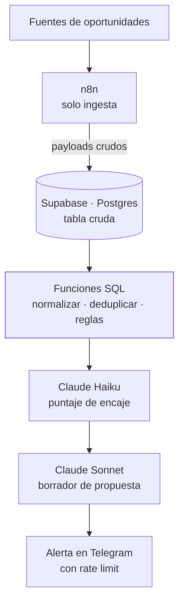

<TLDR>

- **Qué es:** una herramienta interna que detecta oportunidades freelance remotas temprano, las califica con IA y escribe un primer borrador de la propuesta.
- **Para quién:** para mí — es el sistema que uso para conseguir trabajo.
- **Resultado:** <Todo>Carlo — número principal, p. ej. oportunidades procesadas por semana o tiempo desde la publicación hasta la alerta</Todo>

</TLDR>

## Contexto

En el trabajo freelance el tiempo importa: una buena oportunidad encontrada tarde compite con todos los que la encontraron antes. Revisar fuentes a mano es lento, y la mayoría de las publicaciones no encajan.

## El problema

Necesitaba tres cosas que las alertas de empleo genéricas no hacen juntas:

1. **Encontrar oportunidades temprano**, lo más cerca posible del momento en que se publican.
2. **Filtrar por encaje**, no por palabra clave — con un puntaje en el que pueda confiar y que pueda explicar.
3. **Llegar rápido a un primer borrador**, para que responder temprano no signifique responder mal.

Y tenía que costar casi nada: todos los servicios dentro de un free tier al volumen actual.

## Arquitectura



<Todo>Carlo — confirmar que el diagrama coincide con producción (qué dispara el scoring y los borradores, y si se califica cada oportunidad o solo las que pasan las reglas SQL)</Todo>

- **n8n — solo ingesta.** Trae las fuentes y escribe payloads crudos en Supabase. Nunca toca lógica de negocio.
- **Funciones SQL de Postgres.** Todas las reglas viven aquí: normalización, deduplicación, filtrado. Eso es lo que permite migrar después a un core en TypeScript con Inngest sin reescribir las reglas.
- **`canonical_hash`.** La deduplicación usa un hash que es una **columna generada** en Postgres, así que se calcula igual para cada fila sin importar qué workflow la insertó.
- **Claude Haiku y Claude Sonnet.** Haiku califica, Sonnet redacta. La Batch API y el prompt caching bajan el costo.
- **Telegram.** Notificaciones con control de rate limit, para que una ráfaga de publicaciones nuevas no se convierta en una ráfaga de mensajes.

## Decisiones clave y trade-offs

<Decision title="n8n solo ingiere; nunca decide" tradeoff="Dos lugares donde buscar al depurar (el workflow y la base de datos), y SQL es menos accesible que un nodo visual.">

La frontera es estricta: n8n mete los datos, Postgres decide qué significan. Las reglas en funciones SQL están versionadas, se pueden probar y son portables — y sobrevivirán la migración planeada a un core en TypeScript con Inngest.

</Decision>

<Decision title="El hash de deduplicación es una columna generada" tradeoff="Cambiar la definición del hash implica migrar la columna.">

Calcular el hash en n8n obligaba a que cada workflow lo calculara exactamente igual, para siempre. Como columna generada, lo garantiza la base de datos — y eso eliminó una clase entera de bugs de cálculo.

</Decision>

<Decision title="Un modelo chico para calificar, uno más grande para escribir" tradeoff="Dos prompts que mantener y evaluar en vez de uno.">

El scoring corre sobre cada oportunidad nueva, así que usa Claude Haiku. Escribir una propuesta requiere mejor redacción, así que usa Claude Sonnet. La Batch API y el prompt caching reducen el costo de ambos.

</Decision>

<Decision title="Temporal Cloud descartado; todo en free tiers" tradeoff="Menos garantías de ejecución durable que un motor de workflows — aceptable a este volumen, se revisa cuando crezca.">

Temporal Cloud era demasiado caro para una herramienta en esta etapa. Todo el sistema corre dentro de free tiers al volumen actual.

</Decision>

## La parte difícil

**Los NULLs.** Dos campos los volvieron caros.

**El hash canónico.** La forma obvia de construirlo, `concat_ws`, se salta los valores NULL en silencio — así que los campos se recorren de posición y publicaciones distintas pueden producir el mismo texto:

```sql
-- concat_ws se salta los NULL, así que los valores cambian de posición:
select concat_ws('|', 'a', null, 'b');  -- a|b
select concat_ws('|', 'a', 'b', null);  -- a|b   ← mismo resultado, entrada distinta

-- Un coalesce explícito por campo mantiene cada valor en su lugar:
select coalesce('a', '') || '|' || coalesce(null, '') || '|' || coalesce('b', '');  -- a||b
select coalesce('a', '') || '|' || coalesce('b', '') || '|' || coalesce(null, '');  -- a|b|
```

En una llave de deduplicación, esa colisión significa que una oportunidad real se descarta como duplicada. La solución fue un `coalesce` explícito por campo en lugar de `concat_ws`.

**`posted_at`.** La detección temprana depende de saber cuándo se publicó algo. Un valor faltante no se puede reemplazar sin más por la hora de ingesta: una publicación vieja parecería nueva y dispararía una alerta. <Todo>Carlo — cómo se manejan los posted_at en NULL</Todo>

## Resultados

<Metrics>
  <Metric label="Oportunidades procesadas / semana" value="[TODO: Carlo]" />
  <Metric label="Filtradas automáticamente" value="[TODO: Carlo]" />
  <Metric label="Costo real de LLM / mes" value="[TODO: Carlo]" />
  <Metric label="Tiempo desde la publicación hasta la alerta" value="[TODO: Carlo]" />
</Metrics>

## Stack

<Stack>

- n8n
- Supabase
- PostgreSQL · funciones SQL
- Claude Haiku
- Claude Sonnet
- Anthropic Batch API
- Prompt caching
- Telegram Bot API

</Stack>

<CTA />
