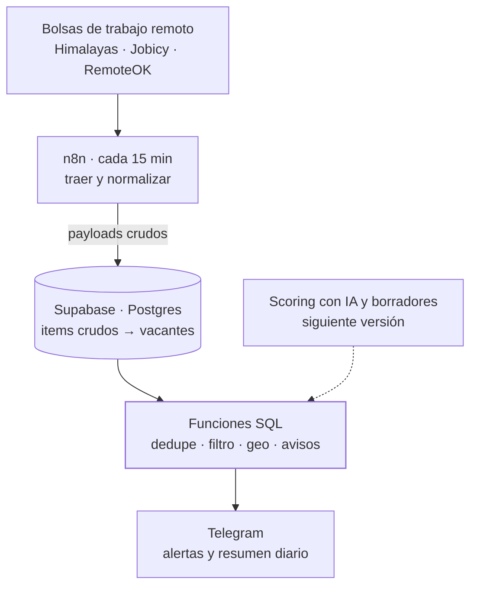

<TLDR>

- **Qué es:** una herramienta interna que ingiere vacantes remotas cada 15 minutos, las deduplica y las filtra en SQL, y me avisa por Telegram.
- **Para quién:** para mí — es el sistema que uso para encontrar trabajo.
- **Resultado:** 1,197 vacantes ingeridas en sus primeros tres días, 27 pasaron el filtro — y medir esas 27 destapó un hueco que una regla nueva cerró, bajando el resumen diario de unas 9 vacantes a unas 3.

</TLDR>

## Contexto

En el trabajo remoto el tiempo importa: una buena vacante encontrada tarde compite con todos los que la encontraron primero. Revisar bolsas de trabajo a mano es lento, y la mayoría de las vacantes no encaja.

## El problema

Necesitaba tres cosas que las alertas de empleo genéricas no hacen juntas:

1. **Encontrar vacantes temprano**, lo más cerca posible de cuando se publican.
2. **Filtrar por encaje**, no por palabra clave — con reglas que pueda leer, probar y explicar.
3. **Avisar sin ruido**: lo que vale la pena atender ya, por separado; lo demás, una vez al día.

## Arquitectura



- **n8n — transporte, no lógica.** Trae las fuentes, normaliza cada item y llama funciones SQL para registrar la corrida y sus payloads crudos. A la hora de avisar, entrega mensajes cuyo texto ya redactó SQL.
- **Funciones SQL de Postgres.** Toda regla vive aquí: ingesta, deduplicación, filtro, el filtro geográfico, qué merece alerta y qué va al resumen. Las reglas en SQL se versionan y prueban como migraciones, y sobreviven si algún día el núcleo sale de n8n.
- **`canonical_hash`.** La deduplicación usa un hash que es una **columna generada** en Postgres, con restricción única, así que se calcula igual para cada fila sin importar qué workflow la insertó.
- **Telegram, con rate limit.** Un mensaje a la vez con una pausa entre ellos; ante un `429` espera el `retry_after` que pide la API y reintenta una vez. Los topes por corrida — 3 alertas individuales, 15 líneas por resumen — evitan que una ráfaga de vacantes se vuelva una ráfaga de mensajes.

## Decisiones clave y trade-offs

<Decision title="n8n mueve datos; Postgres decide" tradeoff="Dos lugares donde buscar al depurar (el workflow y la base), y SQL es menos accesible que un nodo visual.">

La frontera es estricta: n8n mete datos y saca mensajes; Postgres decide qué significa todo. Las reglas quedan versionadas, se pueden probar y son portables — no dependen de la herramienta de workflows.

</Decision>

<Decision title="El hash de deduplicación es una columna generada" tradeoff="Cambiar la definición del hash implica migrar la columna.">

Calcular el hash en n8n obligaba a que cada workflow lo calculara idéntico, para siempre. Como columna generada, lo garantiza la base de datos — y eso eliminó una clase entera de bugs de cálculo.

</Decision>

<Decision title="La confianza en la fecha de una vacante se declara por fuente" tradeoff="Agregar una fuente implica clasificar qué tan confiables son sus fechas antes de activarla.">

Algunas fuentes publican timestamps exactos, otras aproximados, otras ninguno. Cada fuente se configura como `exact`, `approx` o `unknown`, y solo una fecha exacta y reciente puede disparar una alerta individual.

</Decision>

<Decision title="Primero reglas, IA donde las reglas no alcanzan" tradeoff="Hasta que llegue la capa de IA, el filtro es tan listo como sus reglas.">

Las reglas son gratis, instantáneas y explicables, y medirlas muestra exactamente dónde se quedan cortas. La siguiente versión agrega scoring con IA y borradores de propuesta encima — solo para las vacantes que ya pasaron los filtros SQL, con un tope de presupuesto mensual.

</Decision>

## La parte difícil

**Los NULL.** Dos campos los volvieron caros.

**El hash canónico.** La forma obvia de construirlo, `concat_ws`, se salta los NULL en silencio — así que los campos cambian de posición y vacantes distintas pueden producir la misma cadena:

```sql
-- concat_ws se salta los NULL, así que los valores cambian de posición:
select concat_ws('|', 'a', null, 'b');  -- a|b
select concat_ws('|', 'a', 'b', null);  -- a|b   ← mismo resultado, distinta entrada

-- Un coalesce explícito por campo deja cada valor en su lugar:
select coalesce('a', '') || '|' || coalesce(null, '') || '|' || coalesce('b', '');  -- a||b
select coalesce('a', '') || '|' || coalesce('b', '') || '|' || coalesce(null, '');  -- a|b|
```

En una llave de deduplicación, esa colisión significa que una vacante real se descarta como duplicada. La columna generada usa un `coalesce` explícito por campo en vez de `concat_ws`, y después saca el hash SHA-256 del resultado.

**`posted_at`.** La detección temprana depende de saber cuándo se publicó algo. Un valor faltante no se puede reemplazar sin más por la hora de ingesta: una vacante vieja parecería nueva y dispararía una alerta. Por eso los dos usos de la fecha van separados:

```sql
-- Para el filtro de antigüedad, cae a la hora de ingesta solo si la fuente no es confiable:
effective_posted_at := case
  when posted_at_confidence = 'unknown' then ingested_at
  else coalesce(posted_at, ingested_at)
end;

-- Una alerta individual exige una fecha exacta y reciente. Un posted_at NULL vuelve
-- NULL la comparación, así que nunca califica: cae al resumen diario.
when posted_at_confidence = 'exact' and posted_at > now() - max_age then 'high'
```

## Resultados

Medido el 2026-09-24, sobre todas las vacantes ingeridas desde el 21 de septiembre.

<Metrics>
  <Metric label="Vacantes ingeridas en 3 días" value="1,197" note="Himalayas 552 · Jobicy 539 · RemoteOK 106 — unas 400 al día." />
  <Metric label="Pasaron el filtro" value="27 (2.3%)" note="Todo lo demás se descartó automáticamente." />
  <Metric label="Pases que no podía tomar desde México" value="18 de 27" note="Vacantes restringidas por región. La medición llevó a una regla geográfica basada en la ubicación estructurada de cada fuente." />
  <Metric label="Resumen diario, antes → después de la regla geo" value="~9 → ~3" note="Vacantes por día, sobre los mismos datos medidos." />
</Metrics>

## Stack

<Stack>

- n8n
- Supabase
- PostgreSQL · funciones SQL
- pgcrypto (SHA-256)
- Telegram Bot API

</Stack>

<CTA />
