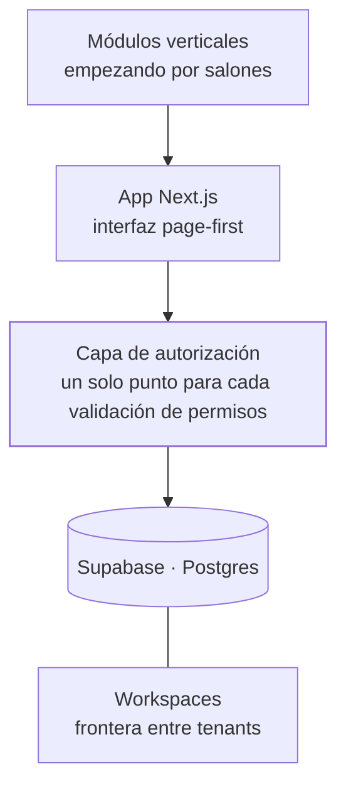

<Todo>Carlo — "Corebase" es nombre de trabajo; decidir si se publica con este nombre</Todo>

<TLDR>

- **Qué es:** una plataforma SaaS modular y multi-tenant hecha con TypeScript, Next.js y Supabase. Está en desarrollo; este es un caso de arquitectura, no el lanzamiento de un producto.
- **Para quién:** la capa que convierte agentes verticales en un producto que muchos negocios pueden usar — empezando por salones, con [Hanami](/work/hanami) como prueba.
- **Resultado:** un solo código base en vez de dos, y 42 validaciones de permisos dispersas consolidadas en una sola capa de autorización.

</TLDR>

## Contexto

Un agente hecho para un cliente, como HanamiBot, demuestra que la idea funciona. Ofrecerlo a muchos negocios es otro problema: tenants, cuentas, permisos, configuración y una interfaz que cada negocio pueda operar por su cuenta. Corebase es la capa de plataforma para eso.

## El problema

Un despliegue a la medida por cliente no escala. La plataforma tiene que mantener aislados los datos de cada negocio, permitir que nuevos verticales se conecten sin crear apps nuevas y seguir siendo lo bastante pequeña para que la mantenga un equipo chico.

## Arquitectura

- **App en Next.js (TypeScript).** Una interfaz page-first al estilo de Notion.
- **Capa de autorización.** El único lugar donde la plataforma decide quién puede hacer qué. Ver [la parte difícil](#la-parte-difícil).
- **Supabase.** Postgres y autenticación.
- **Workspaces.** La frontera entre tenants: cada negocio trabaja dentro de su propio workspace.
- **Módulos verticales.** Funcionalidad específica por industria, empezando por salones.

<Todo>Carlo — detalles del aislamiento multi-tenant: políticas RLS de Supabase y esquema de workspaces</Todo>

<Todo>Carlo — capturas de pantalla</Todo>

## Decisiones clave y trade-offs

<Decision title="Consolidar: Corebase como tronco, Synaptic como donador de código congelado" tradeoff="El código útil de Synaptic hay que portarlo a mano, y Synaptic ya no recibe correcciones.">

Un proyecto anterior, Synaptic, se traslapaba con Corebase. En lugar de mantener los dos, Corebase se volvió el único tronco y Synaptic quedó congelado: se toma código de ahí cuando hace falta y no se construye nada nuevo en él.

</Decision>

<Decision title="Arquitectura page-first, estilo Notion" tradeoff="Un modelo de página genérico es más difícil de diseñar de entrada que un conjunto de pantallas fijas.">

Las páginas son la unidad principal del producto. La funcionalidad nueva llega como algo que vive dentro de una página, no como una sección nueva y separada de la app.

</Decision>

<Decision title="Aislamiento multi-tenant por workspace">

<Todo>Carlo — cómo se garantiza el aislamiento (RLS de Supabase, esquema de workspaces) y por qué</Todo>

</Decision>

<Decision title="Móvil diferido hasta tener ingresos" tradeoff="Por ahora no hay app nativa; en el celular se usa la app web.">

Hay una app en React Native / Expo planeada dentro del monorepo, pero duplicaría la superficie que construir y mantener. Espera hasta que la plataforma tenga ingresos — una decisión de negocio explícita, no un descuido.

</Decision>

## La parte difícil

**Los permisos estaban dispersos por todo el código: 42 llamadas separadas a `isOwner` e `isWorkspaceOwner`.**

**Por qué era un riesgo.**

- Cada funcionalidad decidía por su cuenta quién podía hacer qué. Agregar una funcionalidad implicaba acordarse de poner la validación correcta — y nada fallaba si se te olvidaba.
- Dos helpers con significados traslapados hacían fácil usar el equivocado: ¿dueño del recurso o dueño del workspace?
- En una plataforma multi-tenant, una validación faltante no es un bug menor: es un negocio viendo los datos de otro.
- Responder "¿quién puede hacer X?" implicaba leer 42 lugares del código.

**El diseño final.** Ahora cada validación pasa por una sola capa de autorización. Las funcionalidades hacen una sola pregunta — *¿este usuario puede hacer esta acción aquí?* — y la respuesta sale de un solo lugar que se puede leer, revisar y probar por separado.

<Todo>Carlo — detalles del diseño final (API de la capa, cómo se modelan los roles, si se apoya en RLS)</Todo>

## Resultados

Corebase está en desarrollo, así que todavía no hay métricas de producción.

<Metrics>
  <Metric label="Validaciones de permisos" value="42 → 1 capa" note="Llamadas dispersas a isOwner / isWorkspaceOwner consolidadas en una sola capa de autorización." />
  <Metric label="Códigos base activos" value="2 → 1" note="Synaptic congelado como donador de código; Corebase es el único tronco." />
</Metrics>

## Stack

<Stack>

- TypeScript
- Next.js
- Supabase
- PostgreSQL
- React Native · Expo (planeado)

</Stack>

<CTA />
