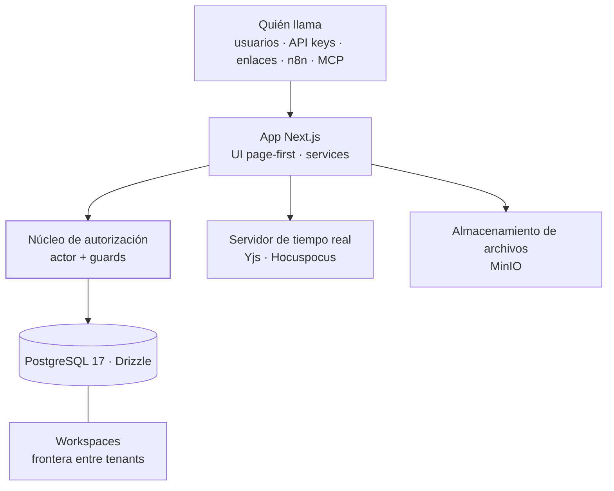

<TLDR>

- **Qué es:** una plataforma modular multi-tenant — bases, tablas, registros, vistas y páginas con co-edición en tiempo real — construida con Next.js, TypeScript, Drizzle y Postgres propio. Está en desarrollo; es un caso de arquitectura, no el lanzamiento de un producto.
- **Para quién:** la capa que convierte agentes verticales en un producto que muchos negocios pueden usar. Las citas y solicitudes de color de [Hanami](/work/hanami) ya se están moviendo a ella desde Airtable.
- **Resultado:** 18 server actions auditadas sin ninguna sin guard de autorización, y el bypass de owner convertido de código copiado a mano en una sola regla con nombre que el linter hace cumplir.

</TLDR>

## Contexto

Un agente construido para un cliente, como HanamiBot, demuestra que la idea funciona. Ofrecerlo a muchos negocios es otro problema: tenants, cuentas, permisos, configuración y una interfaz que cada negocio pueda operar por su cuenta. Corebase es la capa de plataforma para eso.

## El problema

Un despliegue a la medida por cliente no escala. La plataforma tiene que mantener aislados los datos de cada negocio, dejar que nuevas verticales se conecten sin crear apps nuevas y seguir siendo lo bastante pequeña para que la mantenga un equipo chico.

## Arquitectura

- **Actores.** Cada request se resuelve a un actor: un admin de la agencia, un usuario cliente con sus membresías de workspace, una API key, un enlace compartido o el sistema. Las reglas de autorización se escriben una sola vez contra ese modelo.
- **Núcleo de autorización.** Guards como `requireWorkspaceAccess` y `requireStructureEditor` son la única forma en que un service llega a los datos. Ver [la parte difícil](#la-parte-difícil).
- **Workspaces.** La frontera entre tenants. Los miembros tienen un rol — viewer, editor u owner — y los objetos pueden llevar permisos que los ocultan o los dejan en solo lectura.
- **Page-first.** La página es el contenedor universal: bases, tablas y vistas viven dentro de páginas, y los permisos se heredan hacia abajo en el árbol de páginas.
- **Tiempo real y archivos.** La co-edición corre en un servidor aparte con Yjs + Hocuspocus; los archivos van a MinIO.
- **Integraciones.** API keys, webhooks, un servidor MCP y un nodo propio de n8n — el nodo es como los workflows de Hanami escriben en ella.

## Decisiones clave y trade-offs

<Decision title="Consolidar: Corebase como único tronco" tradeoff="El código útil del proyecto anterior hay que portarlo a mano, y ese proyecto ya no recibe correcciones.">

Un proyecto anterior, Synaptic, se traslapaba con Corebase. En lugar de mantener ambos, Corebase se volvió el único tronco y Synaptic quedó congelado.

</Decision>

<Decision title="Arquitectura page-first, estilo Notion" tradeoff="Un modelo genérico de páginas es más difícil de diseñar de entrada que un conjunto de pantallas fijas.">

Las páginas son la unidad principal del producto. La funcionalidad nueva llega como algo que vive dentro de una página, no como una sección separada de la app — y los permisos siguen el árbol de páginas en vez de configurarse por pantalla.

</Decision>

<Decision title="Aislamiento entre tenants en la aplicación, no en políticas de la base" tradeoff="La base de datos no va a frenar una consulta que se salte los guards, así que los guards mismos necesitan auditorías, reglas de lint y pruebas.">

Los services derivan el workspace del registro que cargan y validan al actor contra él antes de devolver nada. Un solo modelo de autorización cubre a todo quien llama — incluidas las API keys y los enlaces compartidos, que no son usuarios de la base de datos.

</Decision>

<Decision title="Móvil diferido hasta tener ingresos" tradeoff="Por ahora no hay app nativa; en el celular se usa la app web.">

Una app en React Native / Expo duplicaría la superficie que construir y mantener. Espera hasta que la plataforma tenga ingresos — una decisión de negocio explícita, no un descuido.

</Decision>

## La parte difícil

**Un predicado crudo respondía tres preguntas distintas.** Una auditoría de permisos encontró `isWorkspaceOwner` en 42 lugares del código, y el bypass de owner — "admin de la agencia o dueño del workspace" — escrito a mano en seis sitios, dos de ellos en la UI.

**Por qué era un riesgo.**

- Cada llamada en realidad preguntaba una de tres cosas: *¿esta persona es un cliente final sujeto a las reglas del portal?*, *¿puede operar el workspace?* o *¿qué nivel de acceso tiene este objeto para ella?* La misma función respondía las tres, así que leer el código no decía cuál se quería decir.
- Una regla escrita a los dos lados de la frontera cliente/servidor se desincroniza. El día que pasa, la UI promete un control que el servidor no aplica.
- En una plataforma multi-tenant, una verificación equivocada no es un bug menor: es un negocio viendo los datos de otro.

**El diseño final.**

1. **Cada pregunta recibió un nombre** en el núcleo de autorización: `isPortalSubject`, `isWorkspaceAdmin` y `effectiveObjectLevelFor`. Los seis bypasses escritos a mano se volvieron `isWorkspaceAdmin`.
2. **Una regla de lint restringe el predicado crudo** a una lista permitida. Sumar un uso obliga a editar esa lista y justificarlo en el diff — la regla falla justo cuando alguien se olvida, que es lo que le faltaba al primer refactor.
3. **Una prueba de humo HTTP cubre el único control al que ninguna prueba de service llegaba.** Su oráculo es el HTML renderizado, no el código de estado: la página hace streaming, así que la respuesta ya es `200` cuando se niega el acceso — una prueba que esperara `404` pasaría con el control abierto. Se comprobó saboteando el control a propósito.

## Resultados

Corebase está en desarrollo, así que todavía no hay métricas de producción. Esto es lo que dejaron el refactor y la auditoría:

<Metrics>
  <Metric label="Server actions sin guard de autorización" value="0 de 18" note="Según la auditoría de permisos." />
  <Metric label="Bypasses de owner escritos a mano" value="6 → 1 regla con nombre" note="Reemplazados por isWorkspaceAdmin; los usos nuevos del predicado crudo fallan el lint." />
  <Metric label="Checks de humo de services tras el refactor" value="906 · 0 fallos" note="En 15 suites de humo, más 19/19 en la nueva prueba HTTP." />
</Metrics>

## Stack

<Stack>

- TypeScript
- Next.js
- React
- PostgreSQL 17
- Drizzle ORM
- Yjs · Hocuspocus
- BlockNote
- MinIO
- Tailwind CSS
- MCP

</Stack>

<CTA />
