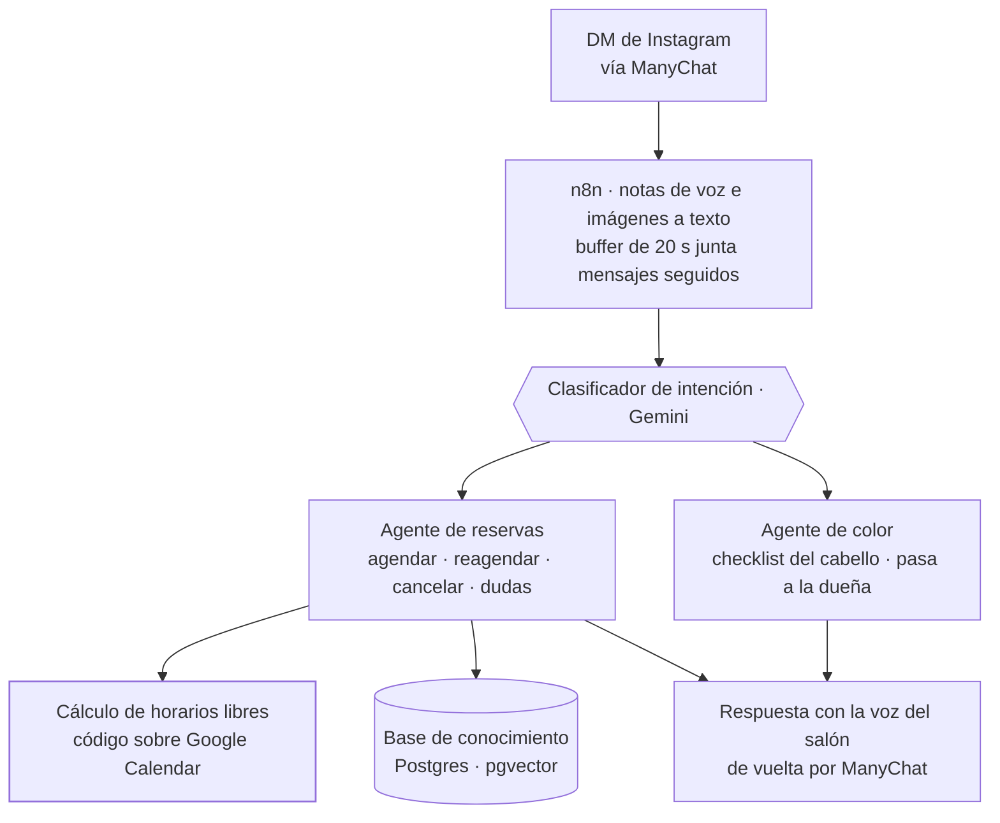

<TLDR>

- **Qué es:** un sitio web (hanamihairstudio.com) y un asistente de reservas en Instagram (HanamiBot), diseñados como un solo sistema.
- **Para quién:** Hanami Hair Studio, un salón en el Centro Histórico de Zacatecas y cliente real de Ápice.
- **Resultado:** el bot atiende los DMs de Instagram del salón desde diciembre de 2025 y va en su tercera versión mayor — con la disponibilidad calculada por código, nunca adivinada por el modelo.

</TLDR>

## Contexto

Hanami es un salón de belleza en el Centro Histórico de Zacatecas con una filosofía clara: estilismo natural e inclusivo. Sus clientes lo descubren en Instagram y llegan desde el celular — primero a ver, después a preguntar por DM.

## El problema

La mayoría de las conversaciones empezaba con las mismas preguntas — precios, cuánto dura una sesión, qué se necesita antes de una coloración, el anticipo — antes de llegar a la que importa: *¿hay lugar?*

Un chatbot genérico no bastaba. Las respuestas tenían que coincidir con los precios y políticas reales del salón, y la disponibilidad con la agenda real de la dueña. En reservas, una respuesta equivocada es peor que ninguna: alguien que llega a un horario que no existe es un cliente que se pierde.

## Arquitectura

El sistema tiene dos superficies con una división clara. **El sitio resuelve las dudas estáticas** (precios, políticas, qué esperar). **El bot resuelve lo dinámico** (disponibilidad y agendar). Se encuentran en un punto: cada botón de "agendar" del sitio abre un DM de Instagram con el bot.

### HanamiBot

- **Canal.** Los DMs de Instagram llegan a n8n a través de ManyChat, y las respuestas vuelven por el mismo camino.
- **Preprocesamiento.** Las notas de voz se transcriben y las imágenes se describen con Gemini, y un buffer de 20 segundos junta los mensajes que llegan en ráfaga, para que el agente responda la idea completa y no cada fragmento.
- **Clasificador y router.** Un clasificador con Gemini etiqueta la intención de cada conversación y un router se la pasa a un solo agente especializado.
- **Agente de reservas.** Agenda, reagenda y cancela en el Google Calendar de la dueña, y responde dudas de servicios, precios y políticas desde una base de conocimiento en Postgres con pgvector.
- **Agente de color.** Los servicios de color requieren valoración, así que este agente junta un checklist de cinco puntos sobre el cabello de la clienta, lo guarda y le pasa la conversación a la dueña. Nunca da un precio final.
- **Cálculo de horarios libres.** La única fuente de disponibilidad. En [la parte difícil](#la-parte-difícil) explico por qué es código y no un prompt.
- **Voz.** Un último paso reescribe cada respuesta con el tono del salón antes de enviarla.

### El sitio

hanamihairstudio.com es una página única en React y TypeScript, construida con Vite y Tailwind y **prerenderizada a HTML estático** en el build, así que el contenido ya está en la página antes de que corra cualquier JavaScript.

- **Información de reserva al frente.** Precios, duración de las sesiones, horarios, formas de pago y la política de depósito para servicios de color están en la página antes de contactar. Objetivo: que la clienta llegue al DM ya pre-calificada, sin preguntas repetidas.
- **Cada llamada a la acción abre el bot.** Los botones de "agendar" son enlaces directos a un DM de Instagram, así que el sitio le pasa la conversación al bot y no a un formulario de contacto.
- **Galería antes/después.** Un carrusel con scroll-snap en móvil y una cuadrícula en escritorio, con la animación desactivada para quien prefiere movimiento reducido.
- **SEO local.** Datos estructurados Schema.org `HairSalon` con dirección, horarios, rango de precios y un catálogo de servicios.

### QA y monitoreo

Los agentes fallan en silencio — una respuesta equivocada dicha con seguridad no lanza ningún error — así que el bot tiene workflows alrededor cuyo único trabajo es vigilarlo.

- **Manejador de errores** (en marcha). Cada ejecución fallida de los workflows de Hanami se guarda en un log de errores y dispara una alerta en Telegram.
- **Telemetría por turno.** Cada turno registra la intención, la latencia, las tools usadas y si cayó en el fallback — incluida una bandera de *mencionó un horario sin consultar la agenda*. En la versión más nueva se escribe antes de enviar el DM, para que un envío fallido no borre el registro.
- **Evaluador nocturno y resumen diario** (construidos para el cambio a v3, hoy en staging). A las 2 a. m. un LLM juez califica las conversaciones del día en tono, resolución, precios alucinados, handoff y cierre; a las 9 a. m. llega a Telegram un resumen con salud técnica, desglose por agente y números del negocio.

## Decisiones clave y trade-offs

<Decision title="Un sistema, dos superficies" tradeoff="La información del salón vive en dos lugares (el sitio y la base de conocimiento) y hay que mantenerla sincronizada.">

Las dudas estáticas se resuelven en el sitio, donde son gratis e instantáneas. El bot solo gasta turnos de conversación en lo que una página no puede resolver: disponibilidad y agendar.

</Decision>

<Decision title="La disponibilidad la calcula el código, nunca el modelo" tradeoff="Cada cambio en los horarios del salón es un cambio de código, y el bot no puede ofrecer horarios si la agenda no responde.">

El modelo es bueno conversando y malo haciendo aritmética de fechas que no ve. Los horarios libres se calculan de forma determinista y se le entregan al modelo como una lista cerrada; el modelo solo redacta la respuesta.

</Decision>

<Decision title="Router más agentes especializados en lugar de un solo agente grande" tradeoff="Más workflows que mantener, y el clasificador se vuelve una pieza crítica.">

Las reservas y las valoraciones de color necesitan reglas distintas — una cierra una venta, la otra no debe dar precio. Agentes separados con prompts cortos son más fáciles de probar y de cambiar sin romperse entre sí.

</Decision>

<Decision title="Prerenderizar el sitio a HTML estático" tradeoff="Un paso de build que renderiza cada página, y la página aun así descarga React para volverse interactiva.">

Las clientas llegan desde Instagram en el celular, y los buscadores necesitan leer precios y horarios. Prerenderizar pone todo el contenido en el HTML sin renunciar a los componentes de React del sitio.

</Decision>

<Decision title="El monitoreo es parte del sistema, no un extra" tradeoff="Más workflows que construir y mantener corriendo alrededor de un solo bot.">

Las alertas de error y la telemetría por turno son workflows separados con sus propias tablas. Es la diferencia entre un demo y un sistema del que un negocio puede depender.

</Decision>

## La parte difícil

**El agente ofrecía horarios de cita que no existían.**

**Cómo se detectó.** Lo reportó la dueña del salón: el bot se equivocaba de mes y ofrecía horarios que en realidad no estaban libres, y después tenía que retractarse.

**Causa raíz.** La versión anterior le pasaba al modelo los eventos crudos de la agenda y le pedía calcular él mismo los horarios libres — restar los eventos ocupados del horario del salón, manejar la zona horaria e incluso respetar un mes que estaba escrito a mano en el prompt. Eso es aritmética, y un modelo de lenguaje hace aritmética adivinando lo que parece correcto.

**La corrección.** El modelo ya no calcula nada que tenga que ver con el tiempo:

1. Un paso de código calcula los horarios libres de 60 minutos en la zona horaria `America/Mexico_City`: horario del salón menos eventos ocupados, con 24 horas mínimas de anticipación, en los próximos 14 días.
2. La lista entra al prompt con timestamps ISO exactos y la fecha de hoy, bajo una regla: *solo puedes ofrecer horarios que aparezcan en esta lista.*
3. Para agendar, el agente copia el valor ISO del horario elegido en la tool de reserva — nunca escribe una fecha por su cuenta.

Después, el cálculo se volvió un sub-workflow reutilizable — la única fuente de verdad de disponibilidad — y la telemetría marca cualquier turno que mencione un horario sin haber consultado la agenda.

La lección aplica a cualquier agente de reservas: la agenda es la fuente de verdad, y el LLM es solo la interfaz hacia ella.

## Resultados

<Metrics>
  <Metric label="Atendiendo los DMs de Instagram del salón desde" value="Dic 2025" note="Agenda, reagenda y cancela directo en la agenda de la dueña." />
  <Metric label="Versiones mayores en producción" value="3" note="La tercera volvió determinista la disponibilidad y agregó SQL parametrizado y validación del payload." />
  <Metric label="Sitio · Lighthouse SEO (móvil)" value="100 / 100" note="Lighthouse 13, 3 corridas, septiembre de 2026." />
  <Metric label="Sitio · Lighthouse Best Practices (móvil)" value="100 / 100" note="Mismas corridas." />
</Metrics>

## Stack

<Stack>

- n8n
- Gemini (agentes, clasificador, embeddings)
- ManyChat · Instagram
- Google Calendar
- PostgreSQL + pgvector
- Airtable
- Telegram (alertas)
- React · TypeScript · Vite
- Tailwind CSS
- Schema.org

</Stack>

<CTA />
