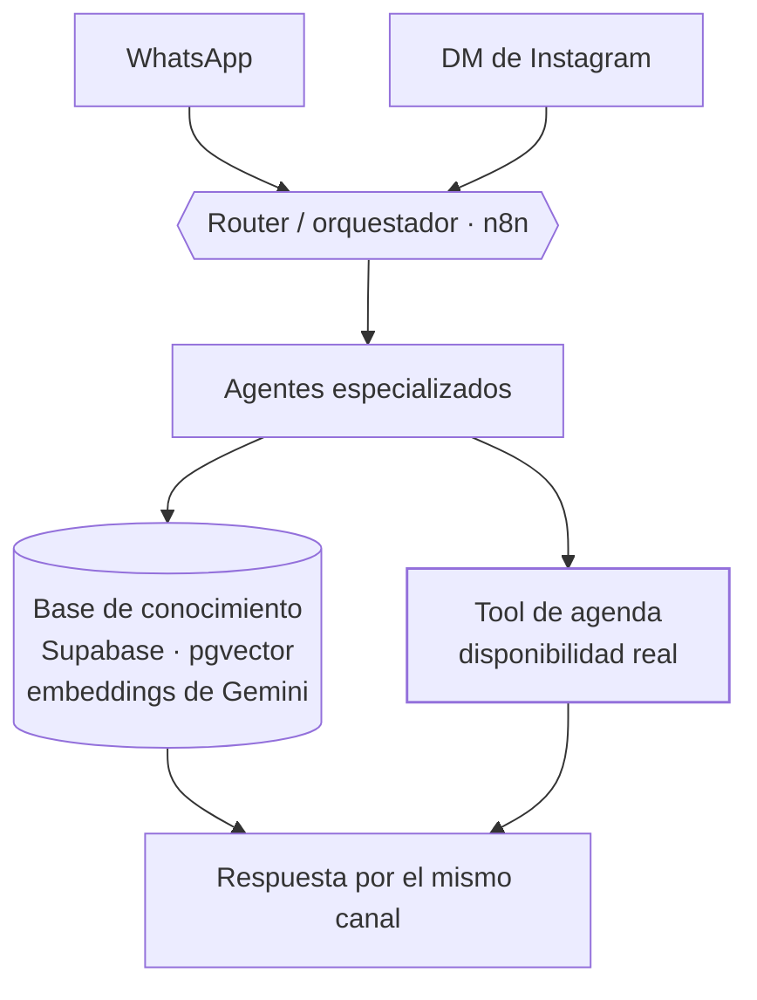

<Todo>Carlo — confirmar que Hanami acepta aparecer con nombre y capturas</Todo>

<TLDR>

- **Qué es:** un sitio web (hanamihairstudio.com) y un agente de reservas (HanamiBot), diseñados como un solo sistema.
- **Para quién:** Hanami Hair Studio, un salón en el Centro Histórico de Zacatecas y cliente real de Ápice.
- **Resultado:** <Todo>Carlo — número principal, p. ej. citas agendadas por el bot al mes o % de conversaciones resueltas sin humano</Todo>

</TLDR>

## Contexto

Hanami es un salón de belleza en el Centro Histórico de Zacatecas con una filosofía clara: estilismo natural e inclusivo. Sus clientes lo descubren en Instagram y llegan desde el celular — primero a ver, después a preguntar por DM o WhatsApp.

## El problema

<Todo>Carlo — volumen de mensajes, tiempo de respuesta antes del bot, citas perdidas y carga de la recepción</Todo>

La mayoría de las conversaciones empezaba con las mismas preguntas — precios, cuánto dura una sesión, qué se necesita antes de una coloración, el anticipo — antes de llegar a la que importa: *¿hay lugar?*

Un chatbot genérico no bastaba. Las respuestas tenían que coincidir con los precios y políticas reales del salón, y la disponibilidad con la agenda real. En reservas, una respuesta equivocada es peor que ninguna: alguien que llega a un horario que no existe es un cliente que se pierde.

## Arquitectura

El sistema tiene dos superficies con una división clara. **El sitio resuelve las dudas estáticas** (precios, políticas, qué esperar). **El bot resuelve lo dinámico** (disponibilidad y agendar).

<Todo>Carlo — confirmar si el sitio enlaza o abre el bot directamente, y cómo</Todo>

### HanamiBot

- **Canales.** WhatsApp y los DMs de Instagram entran al mismo pipeline, así el salón tiene un solo conjunto de reglas en vez de dos.
- **Router / orquestador (n8n).** Decide qué agente especializado atiende cada mensaje.
- **Agentes especializados.** Cada uno tiene una tarea acotada, lo que mantiene los prompts cortos y el comportamiento predecible.
- **Base de conocimiento (RAG).** Servicios, precios y políticas viven en Supabase con pgvector y embeddings de Gemini, y se recuperan al responder — no están escritos dentro de los prompts.
- **Tool de agenda.** La única fuente de disponibilidad. En [la parte difícil](#la-parte-difícil) explico por qué es una regla y no una preferencia.

<Todo>Carlo — qué agenda o sistema de reservas lee y escribe la tool</Todo>

### El sitio

hanamihairstudio.com es un sitio de una sola página hecho con HTML semántico, CSS utility-first y JavaScript vanilla — sin framework.

- **Información de reserva al frente.** Precios, duración de las sesiones, requisitos para coloración y política de anticipo visibles antes de contactar. El objetivo: que el cliente llegue al DM o al bot ya pre-calificado, sin preguntas repetidas.
- **Galería antes/después.** Un carrusel ligero con imágenes en WebP/AVIF: prueba social sin sacrificar velocidad.
- **SEO local.** Optimización on-page para el Centro Histórico de Zacatecas y datos estructurados Schema.org (`HairSalon` / `LocalBusiness`) con geolocalización y horarios.
- **Tono visual editorial**, alineado con el enfoque natural e inclusivo del salón.

### QA y monitoreo

El bot salió a producción con tres workflows separados a su alrededor, porque los agentes fallan en silencio — una respuesta equivocada dicha con seguridad no lanza ningún error.

- **Logger** — guarda registro de las conversaciones y decisiones del bot para poder rastrear cualquier problema.
- **Error Watchdog** — detecta ejecuciones fallidas y lanza una alerta.
- **QA Digest** — un resumen periódico para revisar cómo se está comportando el bot.

<Todo>Carlo — confirmar qué registra cada workflow, a dónde llegan las alertas y cada cuánto corre el QA Digest</Todo>

## Decisiones clave y trade-offs

<Decision title="Un sistema, dos superficies" tradeoff="La información del salón vive en dos lugares (el sitio y la base de conocimiento) y hay que mantenerlos sincronizados.">

Las dudas estáticas se resuelven en el sitio, donde responder es gratis e instantáneo. El bot solo gasta turnos de conversación en lo que una página no puede responder: disponibilidad y reservas.

</Decision>

<Decision title="Sin framework para el sitio" tradeoff="Sin sistema de componentes; está bien para una página, pero un sitio más grande lo necesitaría.">

Los clientes llegan desde Instagram en el celular. HTML semántico, CSS utility-first y JavaScript vanilla significan cero JavaScript innecesario antes de que la página se pueda usar.

</Decision>

<Decision title="La disponibilidad viene de una tool, nunca del modelo" tradeoff="Cada respuesta de disponibilidad cuesta una llamada a la tool, y el bot no puede responder si la agenda no está disponible.">

El modelo es bueno conversando y malo con datos que no puede ver. La disponibilidad siempre se lee de la agenda real mediante una tool; el modelo solo redacta la respuesta.

</Decision>

<Decision title="Router y agentes especializados en vez de un solo agente grande" tradeoff="Más workflows que mantener, y el router se vuelve una pieza crítica.">

Cada agente tiene una tarea acotada y un prompt corto, lo que facilita probar, depurar y cambiar un comportamiento sin romper los demás.

</Decision>

<Decision title="QA y monitoreo desde el primer día" tradeoff="Más workflows que construir antes del lanzamiento.">

Logger, Error Watchdog y QA Digest son workflows separados, no un agregado de último momento. Es la diferencia entre una demo y un sistema del que un negocio puede depender.

</Decision>

## La parte difícil

**El agente inventaba horarios de cita.** Ofrecía horarios que sonaban plausibles pero no estaban en la agenda.

**Cómo se detectó.** <Todo>Carlo — cómo se detectó (reporte del cliente, logs, QA Digest…)</Todo>

**Causa raíz.** El modelo podía responder preguntas de disponibilidad sin consultar la agenda — y cuando se saltaba la tool, llenaba el hueco con horarios que parecían correctos. <Todo>Carlo — confirmar y agregar los detalles exactos</Todo>

**La corrección.** La disponibilidad ahora siempre viene de una llamada a la tool contra la agenda real; el agente no puede ofrecer un horario que la tool no haya devuelto. <Todo>Carlo — detalles exactos de la corrección (reglas en el prompt, llamada forzada a la tool, paso de validación…)</Todo>

La lección aplica a cualquier agente de reservas: la agenda es la fuente de verdad, y el LLM es solo la interfaz hacia ella.

## Resultados

### HanamiBot

<Metrics>
  <Metric label="Citas agendadas por el bot / mes" value="[TODO: Carlo]" />
  <Metric label="Conversaciones resueltas sin humano" value="[TODO: Carlo]" />
  <Metric label="Tiempo de respuesta" value="[TODO: Carlo]" />
  <Metric label="Uptime" value="[TODO: Carlo]" />
</Metrics>

### Sitio web

<Metrics>
  <Metric label="PageSpeed Insights · rendimiento móvil" value="[TODO: Carlo]" />
  <Metric label="LCP · móvil" value="[TODO: Carlo]" />
  <Metric label="Posición en Google / Maps para búsquedas locales" value="[TODO: Carlo]" />
  <Metric label="Preguntas repetidas evitadas (estimado del salón)" value="[TODO: Carlo]" />
</Metrics>

<Todo>Carlo — capturas o video corto de HanamiBot en acción (conversación real anonimizada)</Todo>

## Stack

<Stack>

- n8n
- Supabase
- PostgreSQL + pgvector
- Embeddings de Gemini
- WhatsApp
- Instagram
- HTML · CSS · JavaScript
- Schema.org

</Stack>

<Todo>Carlo — modelo(s) de LLM que usan los agentes</Todo>

<CTA />
